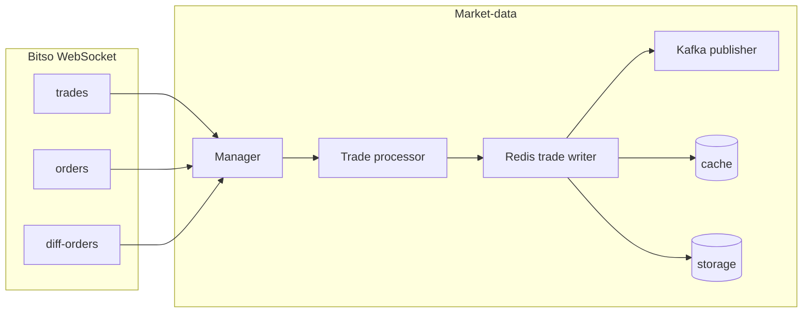

# Intraday Strategy & Metrics Implementation Plan

This document outlines the recommended steps to safely implement trading strategies and metrics for intraday trades. It follows the [Bitso Testing Environment](https://docs.bitso.com/bitso-api/docs/set-up-your-testing-environment) and [API Overview](https://docs.bitso.com/bitso-api/docs/api-overview) practices.

**Principle:** Use the Bitso testing (stage) environment and add safety layers before running new strategies with real value. Backtesting is planned last so that strategies are validated in stage/paper first.

---

## Current Bitso Integration

- **REST API base URL** is configurable via `SetAPIBaseURL()` in `shared/pkg/bitso/client.go`.
- **Testing environment:** `https://stage.bitso.com/api` (production: `https://bitso.com/api`).
- The **trading-engine** already uses the stage URL and stage credentials (`STAGE_BITSO_API_KEY`, `STAGE_BITSO_APISECRET`) in `services/trading-engine/cmd/main.go`.
- You need separate Bitso accounts and API keys for testing vs production; use stage keys when pointing at `stage.bitso.com`.

---

## Implementation Phases (in order)

### Phase 1: Bitso Environment Configuration (env-driven) ✅

**Goal:** Make the Bitso API base URL configurable via environment so you can switch between stage and production without code changes.

**Tasks:**

1. ~~Add `BITSO_API_BASE_URL` to shared config (and optionally to trading-engine config).~~ **Done.** `shared/pkg/config/config.go`: `BitsoAPIBaseURL` loaded from `BITSO_API_BASE_URL`; default `https://stage.bitso.com/api`.
2. ~~In `services/trading-engine/cmd/main.go`, replace the hardcoded `SetAPIBaseURL(...)` with the value from config/env.~~ **Done.** Uses `cfg.BitsoAPIBaseURL`.
3. Document in README / CONFIG:
   - Use `BITSO_API_BASE_URL=https://stage.bitso.com/api` and stage API keys (`STAGE_BITSO_API_KEY`, `STAGE_BITSO_API_SECRET`) for testing.
   - Use `BITSO_API_BASE_URL=https://bitso.com/api` and production API keys only when intentionally going live.
4. Market-data does not call Bitso REST (WebSocket only); no change needed there.

**Files touched:** `shared/pkg/config/config.go`, `services/trading-engine/cmd/main.go`, this plan.

---

### Phase 2: Paper Trading / Dry-Run Mode ✅

**Goal:** Test intraday strategies end-to-end without real funds. This is achieved by using **Bitso’s testing environment**, not by adding a local dry-run flag.

**Bitso testing environment:** [Set up your testing environment](https://docs.bitso.com/bitso-api/docs/set-up-your-testing-environment) — use a separate account and API credentials on **stage** (`https://stage.bitso.com`). Orders sent to the stage API are executed in the test environment only; no production funds are used.

**How this project does it:**

- The shared Bitso client (`shared/pkg/bitso/`) and trading-engine use the **configurable API base URL** (Phase 1).
- Default is **`https://stage.bitso.com/api`**; set `BITSO_API_BASE_URL` only when switching to production.
- Use **stage API keys** with the stage URL. Trading-engine reads `STAGE_BITSO_API_KEY` and `STAGE_BITSO_API_SECRET` (shared config); order-management uses `STAGE_BITSO_API_KEY` and `STAGE_BITSO_APISECRET` for the Bitso sync job. The trading-engine is already wired to stage credentials and stage URL (see `services/trading-engine/cmd/main.go` and `shared/pkg/config`).

**Conclusion:** Paper trading = point the app at Bitso’s testing environment (stage URL + stage keys). No additional dry-run flag or “simulate without calling Bitso” mode is required for this phase.

**Optional enhancement — local dry-run (no Bitso API calls):** For CI, local runs, or an extra safety layer where you never hit Bitso at all, you can add a **dry-run mode** that skips calling `PlaceOrder`:

- Env: `DRY_RUN=true` or config: `DryRun bool`.
- In the executor: if dry-run is set, log the intended order (book, side, amount, price, reason) and return success without calling `bitsoClient.PlaceOrder()`. Optionally persist “would have placed” orders to Redis or a log for downstream metrics/tests.
- Use case: automated tests, or running the engine without a Bitso account. Not required for Phase 2; implement when needed.

---

### Phase 3: Order & Fill Sync (Position Sync from Bitso)

**Goal:** Keep order-management's view of orders and positions in sync with Bitso so that positions and P&L (realized/unrealized) are accurate for intraday metrics.

**Tasks:**

1. **When orders are placed:** ~~Ensure every order placed by the trading-engine is also sent to order-management (e.g. via Kafka or HTTP) with Bitso order ID.~~ **Done.** Trading-engine publishes to Kafka topic `trading.orders.placed` (config: `KAFKA_TOPIC_ORDERS_PLACED`) after each successful `PlaceOrder`. Payload: `order_id`, `book`, `side`, `amount`, `price`, `strategy`. Order-management consumes this topic via `OrdersPlacedConsumer` and creates/updates order records.
2. **Sync order status and fills from Bitso:**
   - Option A: **Polling** – **Done.** A sync job in order-management (`internal/sync/bitso_sync.go`) polls Bitso’s `LookupOrders` for active order IDs, then updates order status and filled amount/price via `SyncOrderFromBitso`. The job runs when Bitso credentials are set in order-management config.
   - Option B: **Webhooks** – If Bitso supports order/fill webhooks, subscribe and push updates to order-management.
3. **Update positions:** When an order moves to filled (or partial fill), order-management should update order status and call position logic (e.g. `UpdateFromFill`). Depends on (2).
4. **Persistence:** Order-management currently uses in-memory repositories; switch to Redis when needed for production.

**Files touched:** `shared/pkg/config` (`KafkaTopicOrdersPlaced`), `services/trading-engine` (Kafka producer, publish after PlaceOrder), executor returns order ID; **order-management** consumer for `trading.orders.placed` (`internal/consumer/orders_placed.go`), Bitso sync job (`internal/sync/bitso_sync.go`, polls LookupOrders and updates orders via `SyncOrderFromBitso`). **Env vars:** Trading-engine uses `STAGE_BITSO_API_KEY` and `STAGE_BITSO_API_SECRET` (shared config); order-management uses `STAGE_BITSO_API_KEY` and `STAGE_BITSO_APISECRET` (and optionally `BITSO_API_BASE_URL`) to enable the sync job.

---

### Phase 4: Daily Loss Limit & Max Drawdown (Live Risk) ✅

**Goal:** Add intraday risk controls so that if daily loss or drawdown exceeds limits, the system stops or pauses trading automatically.

**Tasks:**

1. **Daily loss limit:** **Done.** `TradingConfig.MaxDailyLoss` (currency units; 0 = disabled). Before placing an order, trading-engine calls `SessionRiskProvider.GetSessionRisk()` (e.g. order-management `GET /api/v1/risk/session`) and `Executor.CheckSessionLimits(dailyRealizedPnL, drawdownPct)`; if daily realized P&L ≤ -MaxDailyLoss, execution is rejected.
2. **Max drawdown:** **Done.** `TradingConfig.MaxDrawdownPct` (0–100; 0 = disabled). Same check: if drawdown % ≥ MaxDrawdownPct, execution is rejected.
3. **Configuration:** **Done.** `shared/pkg/models/trading_config.go`: `MaxDailyLoss`, `MaxDrawdownPct`. Trading-engine executor uses them when `CheckSessionLimits` is called.
4. **Metrics:** Already in place (Phase 5): order-management exposes daily P&L and drawdown to Prometheus and Grafana. Order-management also exposes **GET /api/v1/risk/session** returning `daily_realized_pnl` and `drawdown_percent` for the trading-engine to use when a `SessionRiskProvider` is wired (e.g. HTTP client to order-management).

**Files touched:** `shared/pkg/models/trading_config.go`, `services/trading-engine/internal/execution` (CheckSessionLimits, SessionRiskProvider), `services/trading-engine/internal/engine` (call provider + CheckSessionLimits before execute), `services/order-management/internal/metrics` (SessionSnapshot), `services/order-management/internal/server` (GET /api/v1/risk/session). To enable limits: set MaxDailyLoss/MaxDrawdownPct in config and wire a SessionRiskProvider in trading-engine (e.g. HTTP client to order-management).

---

### Phase 5: Intraday Metrics & Observability

**Goal:** Expose metrics that support intraday strategy tuning and monitoring (without changing strategy logic yet).

**Tasks:**

1. **Metrics to add (examples):**
   - Daily realized P&L (gauge or counter).
   - Daily unrealized P&L (gauge).
   - Current drawdown (absolute and/or %).
   - Number of trades today (per book, per strategy).
   - Win rate today (if you have trade outcome data).
2. **Where:** Prefer strategy-executor and/or order-management; use existing Prometheus patterns already in the codebase.
3. **Dashboards:** Add or update Grafana panels for these so operators can monitor intraday risk and performance.

**Files to touch:** `services/strategy-executor/internal/metrics/`, `services/order-management/internal/metrics/`, `monitoring/` or Grafana JSON.

#### Phase 5 Implementation Status

| Item | Status | Location |
|------|--------|----------|
| Shared types & interfaces (MonetaryAmount, PnLRecorder, etc.) | Done | `shared/pkg/metrics/` |
| Prometheus gauges/counters for intraday | Done | `services/order-management/internal/metrics/prometheus.go` |
| IntradayAggregator (calculation logic) | Done | `services/order-management/internal/metrics/intraday_aggregator.go` |
| Manager records trade closed on fill | Done | `services/order-management/internal/manager/order_manager.go` |
| Wire aggregator in app | Done | Aggregator created in `cmd/main.go`, OrderManager constructed with it; manager started on app start |
| Feed equity & unrealized P&L | Done | `feedIntradayMetrics()` goroutine every 60s calls `GetPositionSummary`, then `RecordDailyUnrealizedPnL` and `RecordEquityUpdate` |
| Unit tests (aggregator, manager) | Done | `services/order-management/internal/testing/`, `internal/testing/metrics/` |
| Integration tests | Done | `services/order-management/integration/` (see `testing/integration/order-management/README.md`) |
| Grafana dashboards | Done | `monitoring/grafana/dashboards/trading-metrics.json` (Intraday / P&L row: daily realized/unrealized P&L, drawdown, equity, trades today, wins/losses, win rate %) |

#### Remaining Phase 5 Tasks

- None. Dashboard includes stat and time-series panels for all intraday metrics (see `monitoring/grafana/dashboards/trading-metrics.json`).

---

### Phase 6: Backtesting (last)

**Goal:** Use the existing backtesting framework to validate intraday strategies on historical data after they have been run in stage/paper and risk controls are in place.

**Tasks:**

1. **Run backtests** for any new intraday strategy (e.g. session-based, time-of-day, or existing basic/trend/arbitrage with intraday parameters). Use `services/backtesting/`: run with market-data API (`MarketDataProvider`) or file-based data (`FileProvider`). See `services/backtesting/README.md` and `scripts/run_tests.sh` for tests and coverage.
2. **Compare** backtest metrics (max drawdown, Sharpe, win rate) with what you observe in stage/paper (Grafana intraday panels and order-management metrics).
3. **Document** how to run backtests and how results map to live metrics:
   - **Run backtests:** Start the backtesting service (and market-data if using HTTP provider); POST `/api/v1/backtests` with config (book, strategy, date range, data source). Get results via GET `/api/v1/backtests/{id}/results` and GET `/api/v1/backtests/{id}/report?format=text|json|html`.
   - **Map to live:** Phase 5 metrics (daily realized P&L, drawdown %, trades today, win rate) in Grafana correspond to backtest report fields (Total Return, Max Drawdown, Win Rate, Total Trades). Compare session-level backtest runs with same strategy parameters to stage/paper runs.

**Files to touch:** `services/backtesting/` (existing), this plan, optional: short “Backtesting for intraday” section in `services/backtesting/README.md` or `GETTING_STARTED.md`.

**Phase 6 workflow — run one backtest and compare to Grafana**

1. Start dependencies: market-data (if using HTTP provider), Redis, backtesting service.
2. Create backtest: `POST /api/v1/backtests` (book, strategy, start_date, end_date, initial_balance). Note `id`.
3. Poll `GET /api/v1/backtests/{id}` until status is `completed`.
4. Get results: `GET /api/v1/backtests/{id}/results` or `GET /api/v1/backtests/{id}/report?format=text`.
5. Compare to Grafana: Trading Platform Metrics dashboard — backtest Total Return / Max Drawdown / Win Rate / Total Trades vs Intraday row (Daily Realized P&L, Drawdown %, Trades Today, Win Rate Today %).

**Script:** `scripts/run-one-backtest.sh [BASE_URL]` — creates a backtest, polls until completed, then prints the text report (default BASE_URL=http://localhost:8084).

#### Phase 6 prerequisite: Market-data WebSocket persistence to Redis

**Current state**

- Bitso WebSocket channels (Trades, Orders, Diff-orders) are implemented in `shared/pkg/bitso/websocket.go` and used by market-data's `internal/websocket/manager.go` (see [Bitso Trades](https://docs.bitso.com/bitso-api/docs/trades-channel), [Orders](https://docs.bitso.com/bitso-api/docs/orders-channel), [Diff-orders](https://docs.bitso.com/bitso-api/docs/diff-orders-channel)).
- Market-data receives all three streams; only **trades** are processed (`TradeProcessor` → `TradeEvent`). Processed trades go **only to Kafka** (if enabled); nothing calls `cache.SetTrade` or `storage.StoreTrade`. So `GET /api/v1/trades?from=&to=` reads from Redis and, when empty, returns synthetic data.

**Goal**

Persist WebSocket data to Redis continuously so backtests (Phase 6) use **real** Bitso data via market-data's HTTP API instead of synthetic trades.

**Tasks**

1. **Trades → Redis (required):** Add a single consumer of the processed trade stream that (a) calls `cache.SetTrade(ctx, trade.Book, trade)` and `storage.StoreTrade(ctx, trade)` for each `*models.TradeEvent`, then (b) forwards the same trade to an output channel. Wire the Kafka publisher to read from this component's output instead of from `tradeProcessor.GetProcessedTradesStream()` so the processor has only one consumer. Implement in a new component (e.g. `services/market-data/internal/writer/redis_trade_writer.go` or similar) and wire it in `services/market-data/cmd/main.go` (between processor and publisher; pass `cacheLayer` and `storage`).
2. **Order book (optional):** To support order-book history for backtests, add a component that consumes `GetOrdersStream()` and `GetDiffOrdersStream()`, maintains book state (and/or uses `cache.UpdateOrderBook`), and periodically calls `cache.SetOrderBook` and `storage.StoreOrderBook`. Defer if backtests only need trades.
3. **Ticker:** Bitso WebSocket has no ticker channel. Use trades (and optionally derived OHLC) for backtest ticker history; no extra WebSocket persistence for ticker.
4. **Configuration:** Ensure historical storage `RetentionDays` (and any cleanup) matches the intraday backtest window; Redis persistence (AOF/RDB) so data is not lost before backtests run.

**Data flow**

**Files touched:** `services/market-data/cmd/main.go` (wire new component, publisher reads from writer output), new package under `services/market-data/internal/` for the Redis trade writer (e.g. `writer` or `persistence`). Cache/storage interfaces already exist (`cache.SetTrade`, `storage.StoreTrade`).

---

## Summary Table

| Phase | Description                    | Outcome                                      | Status        |
|-------|--------------------------------|----------------------------------------------|---------------|
| 1     | Bitso env-driven URL           | Switch stage/production via config           | Done          |
| 2     | Paper trading / dry-run        | Use Bitso testing env (stage URL + keys)     | Done (stage)  |
| 3     | Order & fill sync              | Publish + consumer + Bitso sync job         | Done          |
| 4     | Daily loss & drawdown limits   | Config + check before execute; OM session API | Done          |
| 5     | Intraday metrics               | Observability for live intraday trading      | Done (incl. Grafana dashboards) |
| 6     | Backtesting                    | Historical validation; doc in plan           | Documented    |
| 6a    | Market-data WebSocket → Redis  | Trades (and optional order book) persisted for backtest data | Pending       |

---

## Next Steps: Operational Validation, Backtest Comparison, Production

After Phases 1–6 are implemented, follow these priorities to validate and harden the intraday pipeline.

### Priority 1: Operational Validation in Stage

**Goal:** Run and validate the full stage pipeline; confirm orders flow and sync, and risk limits are applied.

**Checklist:**

1. **Environment:** All services use stage Bitso: `BITSO_API_BASE_URL=https://stage.bitso.com/api` (or unset to use default). Trading-engine and order-management use stage API keys (`STAGE_BITSO_API_KEY`, `STAGE_BITSO_API_SECRET` / `STAGE_BITSO_APISECRET`).
2. **Orders flow:** Trading-engine publishes to Kafka topic `trading.orders.placed` after each `PlaceOrder`. Order-management consumes that topic (verify logs: "Orders-placed consumer configured" and consumer group active).
3. **Bitso sync:** Order-management Bitso sync job runs when stage keys are set (verify logs: "Bitso sync job configured"). It polls `LookupOrders` and updates orders via `SyncOrderFromBitso`.
4. **Risk limits:** Trading-engine has `ORDER_MANAGEMENT_URL` set so it can call `GET /api/v1/risk/session`. Configure `MaxDailyLoss` and `MaxDrawdownPct` in trading config (non-zero to enable). Before each order, engine calls session risk and `CheckSessionLimits`; if limits are exceeded, execution is rejected.

**Script:** `scripts/intraday-validate-stage-pipeline.sh` — checks order-management health and `GET /api/v1/risk/session` (and optional Kubernetes mode). Run after deployment to confirm the pipeline and risk endpoint.

**See:** Phase 3 (order/fill sync), Phase 4 (daily loss & drawdown limits).

---

### Priority 2: Backtest vs Live Comparison

**Goal:** Run one backtest and compare its metrics to the Grafana intraday panels so backtest and live stay aligned.

- For real (non-synthetic) backtest data, ensure market-data WebSocket persistence to Redis is implemented (Phase 6 prerequisite) and market-data has been running for the desired date range.

**Steps:**

1. Start dependencies: market-data (if using HTTP provider), Redis, backtesting service (and order-management/trading-engine if validating live in parallel).
2. Run backtest: `scripts/run-one-backtest.sh [BASE_URL]` (default `http://localhost:8084`). Note the reported **Total Return**, **Max Drawdown**, **Win Rate**, **Total Trades**.
3. In Grafana, open the **Trading Platform Metrics** dashboard (Intraday / P&L row). Compare:
   - Backtest **Total Return** ↔ **Daily Realized P&L** (over a matching period).
   - Backtest **Max Drawdown** ↔ **Drawdown %**.
   - Backtest **Win Rate** ↔ **Win Rate Today %**.
   - Backtest **Total Trades** ↔ **Trades Today**.

**Script:** `scripts/intraday-backtest-and-compare.sh [BACKTEST_BASE_URL]` — runs `run-one-backtest.sh`, then prints the comparison checklist and metric mapping so you can fill in Grafana values side-by-side.

**See:** Phase 6 workflow (backtest and compare to Grafana).

---

### Priority 3: Production Config and Secrets

**Goal:** When moving to real funds, use production Bitso URL and keys only, with limits and secret management.

**Checklist:**

- Set `BITSO_API_BASE_URL=https://bitso.com/api` and use **production** Bitso API keys. Never use production keys with the stage URL.
- Set `MaxDailyLoss` and `MaxDrawdownPct` in trading config; keep `SessionRiskProvider` wired (`ORDER_MANAGEMENT_URL`).
- Store production Bitso keys (and Redis password if used) in AWS Secrets Manager (or your secret store). Inject via External Secrets or env; do not commit.
- Monitor Grafana intraday panels and alerts before and after going live.

---

### Priority 4: Production Persistence (Redis for Order-Management)

**Goal:** When ready for production resilience, persist orders and positions in Redis so they survive restarts.

**Checklist:**

- Implement Redis-backed order and position repositories in order-management (plan: "switch to Redis when needed for production" in Phase 3).
- Deploy Redis in the cluster (e.g. StatefulSet or Helm). Use a password and inject via External Secrets (e.g. `REDIS_PASSWORD`).
- Set order-management env: `REDIS_HOST`, `REDIS_PORT`, `REDIS_PASSWORD`, `REDIS_DB` as needed. Health check should reflect Redis connectivity.
- See **REMAINING-PHASES-CHECKLIST.md** (Redis deployment and verification).

---

## References

- [Bitso: Set Up Your Testing Environment](https://docs.bitso.com/bitso-api/docs/set-up-your-testing-environment)
- [Bitso: API Overview](https://docs.bitso.com/bitso-api/docs/api-overview)
- [Bitso: Trades channel](https://docs.bitso.com/bitso-api/docs/trades-channel), [Orders channel](https://docs.bitso.com/bitso-api/docs/orders-channel), [Diff-orders channel](https://docs.bitso.com/bitso-api/docs/diff-orders-channel)
- Project: `DEVELOPMENT-ROADMAP.md`, `REMAINING-PHASES-CHECKLIST.md`
- Bitso client: `shared/pkg/bitso/client.go` (`SetAPIBaseURL`, `LookupOrder`, `LookupOrders`, `OrderTrades`)
- Market-data WebSocket: `shared/pkg/bitso/websocket.go` (WebSocketTrade, WebSocketOrder, WebSocketDiffOrder); `services/market-data/internal/websocket/manager.go`, `internal/processor/trade_processor.go`, `internal/cache/redis.go` (SetTrade), `internal/historical/storage.go` (StoreTrade)

---

**Document version:** 1.8  
**Status:** Phases 1–6 complete. Phase 6 prerequisite (market-data WebSocket persistence to Redis) documented; implementation pending. Next steps: Operational validation in stage (Priority 1), Backtest vs live comparison (Priority 2), Production config and persistence (Priorities 3–4). Scripts: `scripts/intraday-validate-stage-pipeline.sh`, `scripts/intraday-backtest-and-compare.sh`.
