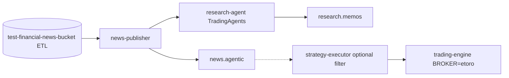

# eToro + TradingAgents — Cold-Path Integration Plan

Date: 2026-05-22  
Repository: `microservices-trading-bot`  
External framework: [Gall-oDrone/TradingAgents](https://github.com/Gall-oDrone/TradingAgents/tree/main)

## 1) Objective

Integrate **multi-agent research** (TradingAgents) and **S3 financial news ETL** with the existing platform **without** putting LLMs on the live order path. eToro execution remains in `trading-engine` (`BROKER=etoro`); research produces **memos and context** operators or downstream rules may use.

## 2) Architecture decision: separate research plane

| Plane | Cluster / namespace | Services | Order placement |
|-------|---------------------|----------|-----------------|
| **Hot path** | `bitso-trading-*` (existing overlays) | market-data, strategy-executor, trading-engine, order-management | Yes (Bitso or eToro) |
| **Cold path** | `trading-research` (`k8s/overlays/research`) | `news-publisher`, `research-agent` | **No** |

Rationale (aligned with `AGENTIC-AI-PRODUCTION-STRATEGY-2026-05-13.md`):

- Isolates LLM cost, latency, and non-determinism from order execution.
- Allows independent scaling and IAM (S3 read + LLM secrets only on research plane).
- Same Kafka cluster can be shared initially; topic ACLs separate `news.agentic` and `research.memos` from `trading.signals`.



## 3) Components delivered in this iteration

### 3.1 `services/news-publisher` (Go)

- Reads latest ETL JSONL from S3.
- Publishes `NewsAgenticEvent` to Kafka.
- HTTP API for sentiment snapshot by symbol.

### 3.2 `services/research-agent` (Python)

- Installs `TradingAgents` from `git+https://github.com/Gall-oDrone/TradingAgents.git@main`.
- FastAPI: `POST /api/v1/research/run` with `{ticker, trade_date}`.
- Optional `news_context` from `news-publisher` HTTP.
- Writes structured JSON memo (stdout / optional S3); **does not** call eToro execution APIs.

### 3.3 eToro linkage

| Layer | Integration |
|-------|-------------|
| Live trading | `trading-engine` + `shared/pkg/etoro` (existing) |
| Research tickers | Map `AAPL`, `BTC-USD` → TradingAgents `propagate(ticker, date)` |
| Signals | Human or rule gate before emitting `TradeSignalEvent` with `metadata.source=research-agent` |

## 4) Kafka topics

| Topic | Producer | Consumer (phase) |
|-------|----------|------------------|
| `news.agentic` | news-publisher | strategy-executor (planned, `NEWS-INTEGRATION-IMPLEMENTATION-PLAN.md`) |
| `research.memos` | research-agent (optional enable) | ops review, future approval UI |
| `trading.signals` | strategy-executor | trading-engine (unchanged) |

## 5) Secrets and IAM

| Secret / IAM | Service |
|--------------|---------|
| S3 read on `test-financial-news-bucket` | news-publisher IRSA |
| `OPENAI_API_KEY`, `ANTHROPIC_API_KEY`, etc. (`TRADINGAGENTS_*`) | research-agent |
| `ETORO_PUBLIC_KEY`, `ETORO_PRIVATE_KEY` | trading-engine only (hot path) |

## 6) Phased roadmap

| Phase | Deliverable | Status |
|-------|-------------|--------|
| P0 | S3 catalog doc + news-publisher + research-agent scaffold + research K8s overlay | **Done** |
| P1 | strategy-executor consumer for `news.agentic` (sentiment filter) | **Done (2026-05-25)** — see `AGENTIC-AI-ETORO-IMPLEMENTATION-STATUS-2026-05-25.md` |
| P2 | research memo store (S3) + operator API in api-gateway | Next |
| P3 | Approved research → `TradeSignalEvent` bridge with audit id | Next |

## 7) Operations

Deploy research plane:

```bash
kubectl apply -k k8s/overlays/research
```

Verify:

```bash
kubectl get pods -n trading-research
curl http://news-publisher.trading-research.svc:8090/health
curl http://research-agent.trading-research.svc:8091/health
```

Run manual research (port-forward):

```bash
curl -X POST http://localhost:8091/api/v1/research/run \
  -H "Content-Type: application/json" \
  -d '{"ticker":"AAPL","trade_date":"2026-03-22","include_news_context":true}'
```

## 8) Related documents

- `docs/ETORO-INTEGRATION.md`
- `docs/agentic-ai/AGENTIC-AI-FINANCIAL-NEWS-S3-ETL-2026-05-22.md`
- `docs/agentic-ai/AGENTIC-AI-INTEGRATION-PLAN-2026-05-07.md`
