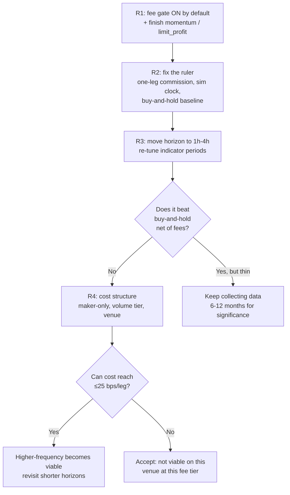

# Path to Profitability — What to Fix, in Priority Order

Date: **2026-09-23**  
Repository: `microservices-trading-bot`  
Branch: `feat/k8s-deployment-manifests`  
Audience: Whoever decides what work happens next on the strategies  
Follows: [`BACKTEST-READINESS-ASSESSMENT-2026-09-22.md`](BACKTEST-READINESS-ASSESSMENT-2026-09-22.md)

The 2026-09-22 assessment established that every strategy loses money after real fees. It did not
establish **why**, and that distinction decides everything that follows:

- If the strategies are **mistuned**, the fix is signal work — indicators, thresholds, filters.
- If the market is **unwinnable at our cost**, signal work is wasted effort and the only real levers
  are cost, horizon, and venue.

This document answers that question with two new measurements, then ranks the fixes.

---

## 1. The diagnosis: a horizon/cost mismatch, not a tuning problem

### 1.1 The available move is far smaller than the cost of capturing it

Distribution of absolute forward returns on `btc_mxn` over the archive window, against the
**150 bps** round trip (65 bps commission + 10 bps slippage, both legs). Full output:
[`evidence-2026-09-23/edge-analysis-1m.txt`](evidence-2026-09-23/edge-analysis-1m.txt).

| Holding horizon | Median move | P90 | P99 | **% of windows that could pay the round trip** |
|---|---:|---:|---:|---:|
| **1 minute** | **3.0 bps** | 13.0 | 34.6 | **0.01%** |
| 5 minutes | 5.9 bps | 21.1 | 50.6 | 0.05% |
| 15 minutes | 9.9 bps | 33.2 | 81.4 | 0.21% |
| 1 hour | 18.9 bps | 61.2 | 160.4 | 1.18% |
| 4 hours | 37.0 bps | 120.6 | 376.4 | 7.02% |
| 24 hours | 101.1 bps | 462.4 | 678.8 | **36.67%** |

The "% that could pay" column assumes **perfect timing** — it is the share of windows where the move
is large enough that a trader who knew the future could profit.

> [!CAUTION]
> The strategies run on **1-minute bars at a 30-second cadence**. At that horizon the median move is
> **3.0 bps against a 150 bps cost — the cost is 50× the signal** — and **99.99% of one-minute windows
> cannot pay the round trip even with perfect foresight.**
>
> This is not a tuning problem. No configuration of RSI, Bollinger, or ATR changes the fact that the
> toll is fifty times the distance travelled.

### 1.2 The perfect-foresight ceiling

A dynamic program computed the *exact* optimal result with complete knowledge of all future prices —
a hard upper bound no strategy can beat on this data.

| Cost level | Per leg | **Oracle maximum** | Oracle trades | Note |
|---|---:|---:|---:|---|
| Frictionless | 0 bps | **1471.49×** | 6,431 | the movement really is there |
| Major-exchange taker | 10 bps | 15.04× | 824 | |
| Backtest engine default | 25 bps | 4.36× | 206 | |
| **Bitso maker** | 50 bps | 2.52× | 58 | post-only limit orders |
| **Bitso retail taker** | 65 bps | 2.22× | 32 | |
| **As configured** (incl. slippage) | 75 bps | **2.10×** | **25** | |
| *Buy and hold, no skill at all* | — | *1.2687×* | *1* | *+26.87% net* |

Three things follow, and they are the crux of this document.

1. **Fees destroy 99.86% of the opportunity.** Going from frictionless to 75 bps/leg collapses the
   ceiling from 1471× to 2.10×. The movement exists; we simply cannot afford to touch it.
2. **At our cost, the optimal number of trades over 34 days is 25** — *fewer than one per day*.
   `mean_reversion` executed **700**. It is trading roughly **28× more often than a trader with
   perfect foresight would**. Every excess round trip is a 150 bps donation.
3. **The entire skill premium available is the gap between 2.10× and 1.27×.** A perfect oracle beats
   doing nothing by ~65 percentage points over 34 days. A realistic strategy captures a fraction of
   that. The honest target is therefore *modestly* beating buy-and-hold — not spectacular returns.

---

## 2. The single highest-impact fix, already validated

**The fee gate works, and it is currently switched off in backtests.**

`FeeGate.HasRates()` returns false unless a fee provider or a non-zero `FallbackRoundTripBPS` is
configured. The backtest engine supplies neither, so the entry gate added on 2026-09-22 silently
no-ops in every result reported so far. Re-running `mean_reversion` with the gate active
(`fallback_round_trip_bps: 150`) gives:

| Configuration | Trades | Win rate | Net P&L |
|---|---:|---:|---:|
| Fee gate **OFF** (as previously reported) | 700 | 0.3% | **−7,291.40 MXN** |
| Fee gate **ON** | **4** | **100%** | **+64.13 MXN** |

Evidence: [`evidence-2026-09-23/backtest-mean-reversion-fee-gate-ON.txt`](evidence-2026-09-23/backtest-mean-reversion-fee-gate-ON.txt).

A **7,355 MXN swing**, achieved purely by refusing 99.4% of the trades. And note the convergence with
§1.2: the gate cut 700 trades down to 4, moving toward the ~25 the oracle says is optimal. Two
independent methods agree that **almost all of this activity should not happen.**

> [!IMPORTANT]
> Do not read "+64.13 MXN on 4 trades" as proof of a profitable strategy. Four trades is
> statistically meaningless, and §4.1's one-leg commission bug means even that figure is optimistic
> (true value is closer to +30 MXN). What *is* proven is the **direction and magnitude**: the gate
> converts a catastrophic loser into approximately break-even by declining to trade.

---

## 3. Recommendations, ranked by impact per unit of effort

### R1 — Turn the fee gate on everywhere, by default ⭐ highest value, lowest effort

| Action | Detail |
|---|---|
| Wire fee rates into the backtest engine | Currently `HasRates()` is false, so every backtest silently measures **ungated** behaviour. This is the single most misleading gap in the harness. |
| Give `FallbackRoundTripBPS` a realistic non-zero default | Or make the strategy refuse to start when it is unset. Silently defaulting to "no gate" is the wrong failure mode for something that decides whether to risk money. |
| Finish `momentum` and `limit_profit` entry gating | Carried over as N2 from the prior report. `fee_gate.go` already exists; mirror the `mean_reversion` integration. |
| Add a regression test asserting the gate is **active** | The gate being off was invisible precisely because nothing asserted it was on. |

### R2 — Fix the measurement before tuning anything

You cannot tune against a biased ruler. All three are known and documented.

| Action | Detail |
|---|---|
| Fix the one-leg commission bug | [`runner.go:215`](../../services/strategy-executor/internal/backtest/runner.go#L215) subtracts only the sell-leg commission. Every per-trade number is optimistic by roughly half a round trip. |
| Make `MinSignalInterval` respect simulated time | It currently throttles on wall-clock, so backtest trade counts are a function of CPU speed. Inject a clock. |
| Add a `buy_and_hold` baseline strategy | §1.2 shows buy-and-hold returned **+26.87%** net. It beat every strategy by a wide margin. It, not the random baseline, is the bar to clear. |
| Repair `internal/processor` tests | Pre-existing build failure on `HEAD`. |

### R3 — Move the operating horizon out by one to two orders of magnitude

This follows directly from §1.1. The strategies should be looking at hours, not minutes.

| Action | Detail |
|---|---|
| Raise `INDICATORS_BAR_INTERVAL` from `1m` toward `1h`–`4h` | At 4h the median move is 37 bps and 7% of windows can pay the round trip; at 1m it is 3 bps and 0.01%. |
| Raise `ROUTER_INTERVAL_SEC` to match | Evaluating every 30 s against 4-hour bars just burns CPU and invites overtrading. |
| Re-tune indicator periods for the new bar size | A 20-period SMA means 20 minutes today and 80 hours at 4h bars. These are different strategies; expect to re-fit. |
| **Budget ~25–60 trades per month, not hundreds** | This is the number the cost structure permits (§1.2). Treat a high trade count as a bug signal. |

> [!WARNING]
> Longer horizons mean far fewer trades, which means **statistical significance gets harder, not
> easier**. At ~30 trades/month, a 34-day window yields ~30 samples — below the 30-sample bar for a
> single regime, let alone five. Expect to need **6–12 months** of archive before a long-horizon
> result means anything.

### R4 — Attack the cost structure; it is the only lever with order-of-magnitude upside

§1.2 shows opportunity scaling super-linearly as cost falls: 75 → 10 bps/leg multiplies the ceiling
**7×** (2.10× → 15.04×) and the viable trade count **33×** (25 → 824).

| Action | Detail |
|---|---|
| Use post-only maker orders wherever possible | Confirmed rates for `btc_mxn` are maker **0.5%** / taker **0.65%** ([`fee_compute_test.go`](../../shared/pkg/bitso/fee_compute_test.go#L26-L29)). Maker-only lifts the ceiling 2.10× → 2.52× and roughly doubles viable trades. Real but not transformative, and it introduces fill risk. |
| Pursue a volume-tier reduction | Rates are fetched per-book from the Bitso API, so a tier improvement flows through automatically with no code change. This is a **commercial** action, not an engineering one. |
| Re-measure slippage empirically | The 10 bps/leg figure is an assumption. With limit orders it may be near zero; on a thin book, market orders may be far worse. We have trade data but **no order-book data** — collecting L2 snapshots would let us measure spread and true slippage instead of guessing. |
| Seriously evaluate whether `btc_mxn` on Bitso retail is the right venue | 65 bps/leg is roughly **6.5× a major exchange**. At 10 bps/leg this market becomes genuinely tradeable. This is the highest-upside item on the list, and it is a business decision rather than a code change. |

### R5 — Only then, work on the signal

Once R1–R4 are done, the remaining question is whether the strategy can capture a worthwhile share of
the ~65-point oracle-over-buy-and-hold premium. Sensible directions:

- **Mean reversion is probably the wrong family at long horizons.** It fits range-bound intraday
  microstructure; at 4h–24h bars in a trending market it will fight the trend. The window studied was
  a **+28.8% uptrend**, which is precisely where mean reversion bleeds.
- **Use the regime router as a position-sizing input, not just a strategy switch.** With so few trades
  permitted, conviction matters more than selection.
- **Require expected move ≥ 2–3× round-trip cost**, not merely ≥ 1×. A 1× threshold puts you at
  break-even before any prediction error; error is guaranteed.

---

## 4. What NOT to spend time on

| Don't | Why |
|---|---|
| Tune indicator parameters at 1-minute bars | §1.1. The ceiling at that horizon is fixed by arithmetic. No parameter set beats a 50:1 cost-to-signal ratio. |
| Chase `high_vol` behaviour | 14 samples from one 7-minute window. There is nothing to fit. |
| Optimise the backtest engine's O(n²) indicator recomputation | A real annoyance at ~6 min/run, but it changes no conclusion. Do it if iteration speed starts blocking R5. |
| Read anything into the current 0.3% / 2.6% win rates | They are the mechanical consequence of a 150 bps toll on 3 bps moves, not evidence that the signals are inverted. |

---

## 5. Suggested sequence



**The uncomfortable summary:** R1 and R2 are cheap and should happen regardless — they fix a harness
that is currently measuring the wrong thing. R3 is a genuine strategy redesign. But **R4 is the item
that decides whether this is a viable business at all**, and most of it is commercial negotiation
rather than code. A 65 bps/leg retail fee against a market whose median hourly move is 19 bps is a
very difficult place to run a systematic trading operation.

---

## 6. Reproducing these measurements

```bash
cd services/strategy-executor

# §1 -- move distribution and the perfect-foresight oracle
go run ./cmd/edge-analysis \
  -archive ./archive -book btc_mxn \
  -from 2026-08-19 -to 2026-09-22T23:59:59Z -bar 1m \
  -commission-bps 65 -slippage-bps 10

# §2 -- same strategy, fee gate switched ON via the fallback round-trip estimate
go run ./cmd/backtest-archive \
  -archive ./archive -book btc_mxn \
  -from 2026-08-19 -to 2026-09-22T23:59:59Z \
  -labels ./regime_labels.csv -strategies mean_reversion \
  -commission-bps 65 -slippage-bps 10 \
  -params '{"min_signal_interval":0,"fallback_round_trip_bps":150}'
```

Drop `fallback_round_trip_bps` to reproduce the ungated 700-trade result.
