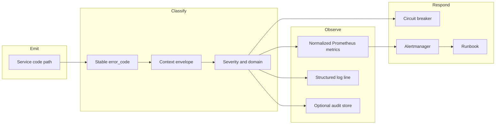

# Phase 1 — Foundations and Gap Analysis

Date: 2026-06-07  
Repository: `microservices-trading-bot`

## 1) Objective

Establish the **baseline** for a production Error Engine: what exists today, what gaps block financial-industry readiness, and the guiding principles that all later phases must follow.

This phase answers: *"Why do we need a unified error engine, and what are we starting from?"*

**See also:** [`README.md`](README.md) (phase map), [`PHASE-2-ERROR-MODEL-AND-CLASSIFICATION-2026-06-07.md`](PHASE-2-ERROR-MODEL-AND-CLASSIFICATION-2026-06-07.md) (next phase).

---

## 2) Definitions

| Term | Meaning in this document |
|------|---------------------------|
| **Error Engine** | Planned cross-cutting capability: taxonomy, context, recording, and observability standards — not a single monolithic service in v1. |
| **Operational error** | Failure that degrades availability or latency but does not corrupt financial truth (e.g. transient Bitso 503, snapshot fetch timeout). |
| **Financial integrity error** | Failure that can cause incorrect P&L, wrong fill prices, fee drift, or unauthorized trading (Severity P0). |
| **Structured error** | Machine-readable record with stable `error_code`, severity, **level** (green/yellow/red), domain, and context envelope (Phase 2). |
| **Traffic-light level** | Operator-facing `green`, `yellow`, or `red` — worst-level-wins on dashboards; maps to severity and financial impact. |
| **Canonical execution data** | Fills, fees, and order IDs from the platform sync path — see `docs/agentic-ai/AGENTIC-AI-PRODUCTION-STRATEGY-2026-05-13.md`. |

---

## 3) Guiding principles (financial industry)

Aligned with `docs/agentic-ai/AGENTIC-AI-PRODUCTION-STRATEGY-2026-05-13.md` and existing soak/rollback practices:

1. **Deterministic systems own money and truth.** P&L arithmetic, fee aggregation, position, and venue reconciliation belong in **code** — not in logs alone or LLM reasoning. Errors affecting P&L are **Severity P0**.
2. **Full audit trail.** Every financial-integrity error must capture: timestamp, service, `error_code`, book, strategy (if applicable), internal order ID, Bitso OID (if applicable), and correlation ID for cross-service tracing.
3. **Fail-safe defaults.** Circuit breakers, `DRY_RUN`, router pause-on-stale, and trading halt gates must activate on defined error classes — not operator memory.
4. **Idempotent recovery.** Venue sync errors (Bitso race, deferred trades) must be retryable without double-counting fills or publishing duplicate events.
5. **Separation of concerns.** Operational errors (retry/skip cycle) vs financial integrity errors (halt + alert + reconciliation) follow different response paths.
6. **Human-in-the-loop for remediation.** Automated triage (ops-agent) may summarize and recommend; state-changing fixes require operator approval unless an explicit runbook auto-action is approved.

---

## 4) Current state

### 4.1 Microservices landscape

Nine Go services form the trading pipeline:

| Service | Role |
|---------|------|
| `market-data` | Ingest Bitso WebSocket/REST; publish ticks and bars |
| `strategy-executor` | Run strategies; consume market data; publish signals |
| `strategy-router` | Regime classification; start/stop strategies |
| `trading-engine` | Consume signals; pre-trade validation; place orders |
| `order-management` | Bitso sync; fill events; session risk |
| `api-gateway` | External HTTP API |
| `ops-agent` | Incident triage assistance |
| `agent-coordinator` | Multi-agent fan-out |
| `backtesting` | Offline simulation (non-hot path) |

Data flows: market-data → Kafka → strategy-executor → Kafka → trading-engine → order-management → Kafka fill events → strategy-executor.

### 4.2 Logging

| Pattern | Location | Limitation |
|---------|----------|------------|
| Standard library `log.Printf` | `strategy-router`, `trading-engine` executor | No structured fields; no correlation ID |
| Zerolog wrapper | `services/strategy-executor/internal/logger/logger.go` | JSON/console capable but no shared error schema |
| Prefixed loggers | `[EXECUTOR]`, `[INDICATORS]` | Service-local; hard to query across pods |

**Gap:** No shared correlation ID propagated through Kafka events or HTTP calls. Cross-service incident investigation requires manual log stitching.

### 4.3 Metrics (error counters today)

Each service exposes Prometheus counters independently:

| Service | Example metrics | Labels |
|---------|-----------------|--------|
| trading-engine | `bitso_balance_fetch_errors_total`, `kafka_consumer_errors_total`, `order_placed_events_publish_errors_total` | Mostly unlabeled counters |
| order-management | `bitso_sync_errors_total`, `user_trades_poll_errors_total`, `session_risk_request_errors_total` | Unlabeled counters |
| strategy-router | `strategy_router_evaluation_errors_total` | `book` |
| strategy-executor | `strategy_errors_total`, `market_data_errors_total` (via custom CounterVec) | `strategy`, `book`, `error_type` |
| market-data | `market_data_websocket_errors_total`, `market_data_storage_errors_total`, `market_data_historical_errors_total` | Mixed |
| api-gateway | `api_gateway_backend_errors_total` | `service`, `endpoint`, `error_type` |
| backtesting | `backtesting_data_fetch_errors_total` | `source` |

**Gap:** Inconsistent naming (`error_type` vs unlabeled), no shared `error_code` dimension, no `severity` or `financial_impact` labels. Cross-service dashboards require per-metric knowledge.

### 4.4 Alerting

`k8s/monitoring/prometheus-rules.yaml` defines:

- **trading-alerts:** service down, high 5xx rate, latency, pod restarts, memory
- **strategy-router-alerts:** blocked position, evaluation failures, router not evaluating

**Gap:** No alerts for financial integrity (P&L reconciliation delta, fee assumption drift, fill price mismatch). Venue degradation alerts are generic (service down) rather than error-code-specific.

### 4.5 Incidents and runbooks

- Post-mortems: `docs/incident-reports/` (e.g. avg-price discrepancy — `ORDER-MANAGEMENT-BITSO-AVG-PRICE-DISCREPANCY-2026-05-16.md`)
- Runbooks: `docs/runbooks/LIMIT-PROFIT-RUNBOOK.md`, agent-coordinator checklists
- Soak rollback: `docs/strategy-fee-accuracy/STAGE-EXECUTION-SOAK-OPERATOR-GUIDE-2026-06-04.md`

**Gap:** Incidents are **reactive** — discovered via P&L drift or manual reconciliation, not proactive error-code alerts. No template linking error codes to runbook sections.

### 4.6 Ops AI

- `services/ops-agent` — Prometheus query + HTTP health tools; read-only by default
- `services/agent-coordinator` — fans out to child agents
- `shared/pkg/agent` — policy, budget, trace structures

**Gap:** No structured **error artifact** feed (JSON bundle of recent P0/P1 errors with context). Agents query metrics ad hoc rather than consuming classified error records.

### 4.7 Graceful degradation (existing patterns to preserve)

The Error Engine must **not** break proven patterns:

- **Strategy router:** snapshot/client errors increment `strategy_router_evaluation_errors_total` and skip the cycle — `services/strategy-router/internal/router/router.go`
- **Router pause-on-stale:** bar-first indicator health triggers regime pause — `docs/strategy-fee-accuracy/BAR-FIRST-INDICATORS-PRODUCTION-2026-06-04.md`
- **Bitso sync deferral:** filled orders without trades yet defer rather than persist limit-as-fill — `services/order-management/internal/sync/bitso_sync.go`

---

## 5) Gap summary

| Area | Current pattern | Gap | Phase that addresses |
|------|-----------------|-----|----------------------|
| Logging | Per-service, unstructured | No correlation ID or error schema | Phase 2 |
| Metrics | Ad-hoc counters | No unified taxonomy or labels | Phase 2, 3 |
| Alerts | Generic + router-specific | Missing financial/reconciliation classes | Phase 3, 4 |
| Incidents | Reactive post-mortems | No proactive classification pipeline | Phase 4, 5 |
| Ops AI | Prometheus/health tools | No error artifact feed | Phase 5 |
| Operator UX | Grafana + logs | No unified green/yellow/red platform health | Phase 2, 3 |
| Recovery | Service-specific | No documented circuit breaker matrix | Phase 4 |
| Audit | Log lines | No durable error record store | Phase 2, 5 |

---

## 6) Target architecture (high level)

**v1 scope:** shared library contract + per-service adoption + Prometheus normalization. Dedicated error-ingestion service and OpenTelemetry are **future** (Phase 3 stretch, Phase 6).

---

## 7) Non-goals for Error Engine v1

- Replacing existing metrics overnight (migration is incremental)
- LLM-computed P&L or fill reconciliation
- Autonomous order cancellation or strategy changes without operator gate
- New infrastructure beyond existing Prometheus/Grafana/Alertmanager stack

---

## 8) Exit criteria (Phase 1 complete)

- [x] Current-state inventory documented (this file)
- [x] Financial-industry principles defined
- [x] Gap table maps to later phases
- [ ] Stakeholder review: principles align with ops and trading policy (human step before Phase 2 implementation)

**Next:** [`PHASE-2-ERROR-MODEL-AND-CLASSIFICATION-2026-06-07.md`](PHASE-2-ERROR-MODEL-AND-CLASSIFICATION-2026-06-07.md)
