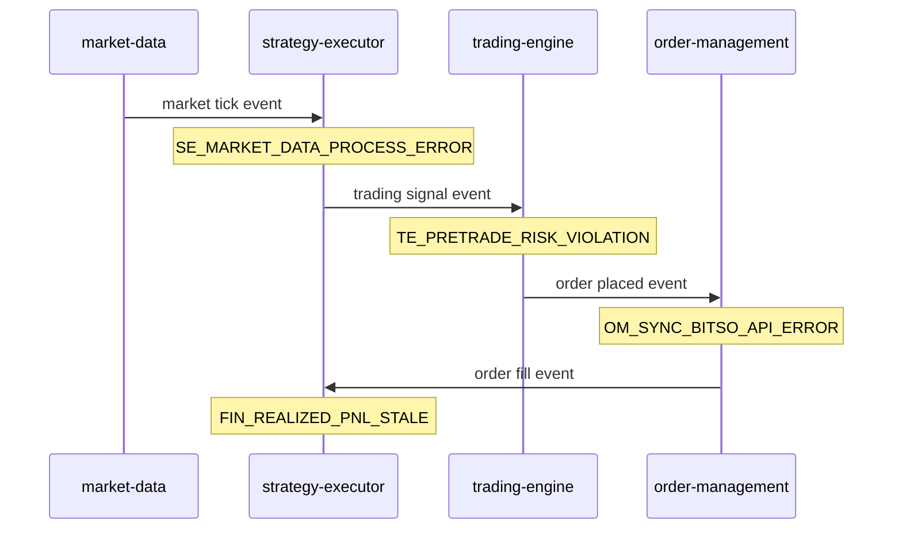

# Phase 2 — Error Model and Classification

Date: 2026-06-07  
Repository: `microservices-trading-bot`

## 1) Objective

Define a **unified error model** for the Error Engine: classification dimensions, a shared context envelope, stable error codes, and propagation rules across the trading pipeline.

This phase is **design only** — no code changes. It provides the contract that Phase 3 (metrics) and Phase 4 (financial errors) will implement.

**Prerequisites:** [`PHASE-1-FOUNDATIONS-AND-GAP-ANALYSIS-2026-06-07.md`](PHASE-1-FOUNDATIONS-AND-GAP-ANALYSIS-2026-06-07.md)

**Next:** [`PHASE-3-OBSERVABILITY-TRACKING-AND-ALERTING-2026-06-07.md`](PHASE-3-OBSERVABILITY-TRACKING-AND-ALERTING-2026-06-07.md)

---

## 2) Classification dimensions

Every structured error MUST include these dimensions:

| Dimension | Values | Purpose |
|-----------|--------|---------|
| `domain` | `venue`, `kafka`, `strategy`, `risk`, `reconciliation`, `infra`, `agent` | Which subsystem failed |
| `severity` | `P0`, `P1`, `P2`, `P3` | Response urgency (see §3) |
| `recoverability` | `transient`, `retryable`, `fatal` | Retry/backoff behavior |
| `financial_impact` | `none`, `potential`, `confirmed` | Whether P&L or positions may be wrong |

Optional but recommended:

| Dimension | Values | Purpose |
|-----------|--------|---------|
| `error_code` | Stable string (see §5) | Alert routing, runbook lookup, metric label |
| `retry_after_ms` | Integer | Backoff hint for pollers/sync jobs |

---

## 3) Severity definitions

| Severity | Name | Financial impact | Typical response | Example |
|----------|------|------------------|------------------|---------|
| **P0** | Critical / integrity | `confirmed` or high `potential` | Halt trading or P&L updates; page on-call | Fill price persisted as limit; reconciliation delta > threshold |
| **P1** | Major / degraded | `potential` | Circuit breaker; alert within 5 min | Bitso sync errors sustained; balance fetch failures |
| **P2** | Minor / operational | `none` | Log + metric; retry | Single snapshot fetch timeout; one Kafka publish retry |
| **P3** | Informational | `none` | Metric only | Expected validation reject; dry-run skip |

**Rule:** If `financial_impact=confirmed`, severity MUST be at least **P0**.

---

## 4) Context envelope

All services emit errors with a shared JSON/log field set:

```json
{
  "error_code": "OM_SYNC_TRADES_DEFERRED",
  "domain": "venue",
  "severity": "P2",
  "recoverability": "retryable",
  "financial_impact": "none",
  "service": "order-management",
  "correlation_id": "550e8400-e29b-41d4-a716-446655440000",
  "trace_id": "",
  "book": "btc_mxn",
  "strategy": "limit_profit",
  "order_id": "internal-uuid",
  "bitso_oid": "abc123",
  "message": "order_trades not yet available; deferring sync",
  "cause": "bitso error 378",
  "occurred_at": "2026-06-07T12:00:00Z"
}
```

### Field requirements by domain

| Field | venue | kafka | strategy | risk | reconciliation |
|-------|-------|-------|----------|------|----------------|
| `book` | Required | Optional | Required | Required | Required |
| `strategy` | Optional | Optional | Required | Required | Required |
| `order_id` | When order-related | — | When signal-related | When reject | Required |
| `bitso_oid` | When venue order exists | — | — | — | Required |
| `correlation_id` | Required | Required | Required | Required | Required |

### Correlation ID propagation

1. **HTTP ingress** (`api-gateway`): generate or accept `X-Correlation-ID`; forward to backends.
2. **Kafka events:** add `correlation_id` to event schema (`shared/pkg/models/events.go` — future change).
3. **Internal calls:** pass via `context.Context` value (planned `shared/pkg/errortracking` helper).
4. **Router → executor:** inherit from evaluation cycle ID or generate per `RunOnce`.

`trace_id` reserved for OpenTelemetry (Phase 3 stretch); empty in v1.

---

## 5) Error code catalog (initial)

Naming convention: `{SERVICE_PREFIX}_{DOMAIN}_{DESCRIPTION}` in `SCREAMING_SNAKE_CASE`.

### order-management

| Code | Severity | Recoverability | Maps to existing metric |
|------|----------|----------------|---------------------------|
| `OM_SYNC_BITSO_API_ERROR` | P1 | retryable | `bitso_sync_errors_total` |
| `OM_SYNC_TRADES_DEFERRED` | P2 | retryable | (log-only today) |
| `OM_SYNC_AVG_PRICE_MISMATCH` | P0 | fatal | (incident-driven; no metric yet) |
| `OM_USER_TRADES_POLL_ERROR` | P1 | retryable | `user_trades_poll_errors_total` |
| `OM_SESSION_RISK_REQUEST_ERROR` | P1 | retryable | `session_risk_request_errors_total` |
| `OM_KAFKA_PUBLISH_FAILED` | P1 | retryable | `events_failed` (labeled) |

### trading-engine

| Code | Severity | Recoverability | Maps to existing metric |
|------|----------|----------------|---------------------------|
| `TE_PRETRADE_RISK_VIOLATION` | P2 | fatal | pretrade reject path |
| `TE_BALANCE_FETCH_ERROR` | P1 | retryable | `bitso_balance_fetch_errors_total` |
| `TE_KAFKA_CONSUMER_ERROR` | P1 | retryable | `kafka_consumer_errors_total` |
| `TE_ORDER_PLACED_PUBLISH_ERROR` | P1 | retryable | `order_placed_events_publish_errors_total` |
| `TE_BITSO_ORDER_REJECTED` | P2 | fatal | venue reject |

### strategy-executor

| Code | Severity | Recoverability | Maps to existing metric |
|------|----------|----------------|---------------------------|
| `SE_STRATEGY_RUNTIME_ERROR` | P1 | varies | `strategy_errors_total` |
| `SE_MARKET_DATA_PROCESS_ERROR` | P2 | retryable | `market_data_errors_total` |
| `SE_INDICATOR_STALE` | P1 | retryable | snapshot `data_healthy=false` |
| `SE_SIGNAL_PUBLISH_ERROR` | P1 | retryable | publisher errors |

### strategy-router

| Code | Severity | Recoverability | Maps to existing metric |
|------|----------|----------------|---------------------------|
| `SR_EVALUATION_ERROR` | P2 | retryable | `strategy_router_evaluation_errors_total` |
| `SR_SNAPSHOT_UNHEALTHY` | P1 | retryable | regime pause path |
| `SR_STRATEGY_SWITCH_FAILED` | P1 | retryable | blocked/switch errors |

### market-data

| Code | Severity | Recoverability | Maps to existing metric |
|------|----------|----------------|---------------------------|
| `MD_WEBSOCKET_ERROR` | P1 | retryable | `market_data_websocket_errors_total` |
| `MD_WEBSOCKET_SUBSCRIBE_ERROR` | P1 | retryable | `market_data_websocket_subscribe_errors_total` |
| `MD_STORAGE_ERROR` | P1 | retryable | `market_data_storage_errors_total` |
| `MD_HISTORICAL_FETCH_ERROR` | P2 | retryable | `market_data_historical_errors_total` |

### api-gateway

| Code | Severity | Recoverability | Maps to existing metric |
|------|----------|----------------|---------------------------|
| `AG_BACKEND_ERROR` | P2 | retryable | `api_gateway_backend_errors_total` |
| `AG_BACKEND_TIMEOUT` | P2 | retryable | backend duration + errors |

### Financial / reconciliation (cross-cutting)

| Code | Severity | Recoverability | Notes |
|------|----------|----------------|-------|
| `FIN_FEE_ASSUMPTION_DRIFT` | P1 | retryable | Configured vs realized fee delta — see POINT-9 |
| `FIN_RECONCILIATION_DELTA` | P0 | fatal | Internal P&L vs canonical execution |
| `FIN_REALIZED_PNL_STALE` | P1 | retryable | Gauge not updated after fill event |

---

## 6) Propagation rules

### 6.1 Kafka event chain



**Rules:**

1. Downstream services **inherit** `correlation_id` from upstream Kafka headers/payload when present.
2. Services **do not downgrade** severity when re-emitting (P0 stays P0).
3. Transient upstream errors (P2) must not cascade to P0 unless financial state is corrupted.

### 6.2 HTTP chain (router → executor)

- `strategy-router` calls `GET /api/v1/indicators/{book}/snapshot` and strategy start/stop endpoints.
- On failure: emit `SR_EVALUATION_ERROR` with `book`, increment existing counter, **skip cycle** (preserve `router.go` behavior).
- Include `correlation_id` in router audit log (`services/strategy-router/internal/router/audit.go`).

### 6.3 Wrapping and cause chains

- Use wrapped errors in Go (`fmt.Errorf("...: %w", err)`) for debugging.
- Structured envelope exposes `cause` as the immediate upstream message — not full stack in production logs.
- P0/P1 errors: include `order_id` / `bitso_oid` when available for operator queries.

---

## 7) Planned shared library contract (future implementation)

Location (proposed): `shared/pkg/errortracking/`

```go
// Design sketch — not implemented
type Error struct {
    Code             string
    Domain           string
    Severity         string
    Recoverability   string
    FinancialImpact  string
    Context          Context
    Cause            error
}

type Context struct {
    CorrelationID string
    TraceID       string
    Service       string
    Book          string
    Strategy      string
    OrderID       string
    BitsoOID      string
}

func (e *Error) Record(metrics Recorder, logger Logger)
func CorrelationID(ctx context.Context) string
func WithCorrelationID(ctx context.Context, id string) context.Context
```

Services call `Record()` to emit structured log + normalized metric in one path.

---

## 8) Migration from existing patterns

| Existing | Target |
|----------|--------|
| `RecordBitsoSyncError()` | `Record()` with `OM_SYNC_BITSO_API_ERROR` |
| `RecordStrategyError(strategy, book, errorType)` | Map `errorType` → stable `error_code`; keep backward-compatible metric |
| `log.Printf` in router | Structured zerolog/json with envelope |
| Unlabeled counters | Add `error_code` label via new metric name or vec migration |

**Compatibility:** Old metric names remain during transition; dashboards dual-query until cutover (Phase 6).

---

## 9) Exit criteria (Phase 2 complete)

- [x] Classification dimensions defined
- [x] Context envelope specified
- [x] Initial error code catalog mapped to existing metrics
- [x] Propagation rules documented
- [ ] Error code catalog reviewed against open incidents and soak failure modes (human step)
- [ ] Implementation of `shared/pkg/errortracking` (deferred to Phase 6 rollout)
