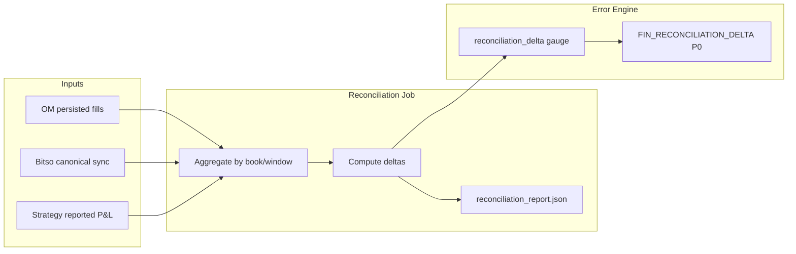

# Phase 4 — Financial, Venue, and Risk Errors

Date: 2026-06-07  
Repository: `microservices-trading-bot`

## 1) Objective

Define **financial-industry error classes** specific to crypto venue trading: fill integrity, fee honesty, pre-trade risk, venue degradation, stale data, and session risk — plus a **circuit breaker matrix** for automated safe responses.

**Prerequisites:** Phases 2–3

**Next:** [`PHASE-5-INCIDENT-LIFECYCLE-AND-OPERATIONS-2026-06-07.md`](PHASE-5-INCIDENT-LIFECYCLE-AND-OPERATIONS-2026-06-07.md)

---

## 2) Financial error taxonomy

Errors that can affect **money, position, or regulatory audit** require stricter handling than operational blips.

| Class | Description | Default level | Default severity | financial_impact |
|-------|-------------|---------------|------------------|------------------|
| **Fill integrity** | Wrong avg price, limit-as-fill, missed trade correction | red | P0 | confirmed |
| **Fee integrity** | Configured fee ≠ realized fee beyond tolerance | yellow | P1 | potential → confirmed |
| **P&L truth** | Strategy P&L diverges from OM/canonical execution | red | P0 | confirmed |
| **Pre-trade risk** | Order blocked by risk rules (expected) | green | P2 | none |
| **Pre-trade risk bypass** | Order submitted despite failed validation | red | P0 | confirmed |
| **Venue connectivity** | Bitso API/WS failures affecting order state | yellow | P1 | potential |
| **Stale reference data** | Indicators/bars too old for safe decisions | yellow | P1 | potential |
| **Session / balance** | Cannot verify balance or session risk limits | yellow | P1 | potential |

---

## 3) Error classes with repository precedents

### 3.1 Fill price / P&L truth

**Incident:** `docs/incident-reports/order-management/ORDER-MANAGEMENT-BITSO-AVG-PRICE-DISCREPANCY-2026-05-16.md`

| Attribute | Value |
|-----------|-------|
| Code | `OM_SYNC_AVG_PRICE_MISMATCH` |
| Root cause | Limit price used as fill average before `/order_trades` VWAP |
| Detection | Compare OM `avg_price` to Bitso CSV/UI; reconciliation batch |
| Response | P0 alert; block further P&L updates for affected orders; post-mortem |

**Prevention (implemented):** defer sync when trades unavailable; VWAP from `OrderTrades`. Error Engine adds **proactive** alert if limit == avg_price on filled orders (heuristic).

### 3.2 Fee assumption drift

**Reference:** `docs/strategy-fee-accuracy/POINT-9-REALIZED-FEES.md`

| Attribute | Value |
|-----------|-------|
| Code | `FIN_FEE_ASSUMPTION_DRIFT` |
| Detection | Histogram: `abs(configured_fee_rate - realized_fee_rate)` per fill |
| Threshold | TBD per book (start: > 1 bp from configured maker/taker) |
| Response | P1 alert; strategy continues but operator reviews; escalate if sustained |

### 3.3 Pre-trade risk violations

**Reference:** `services/trading-engine/internal/execution/pretrade_validator.go`

| Attribute | Value |
|-----------|-------|
| Code | `TE_PRETRADE_RISK_VIOLATION` |
| Detection | Validator reject with reason label |
| Response | P2 metric (expected); no page unless reject rate spikes abnormally |

**Anomaly:** If signal consumed but no corresponding reject/order metric → investigate as `TE_PRETRADE_RISK_BYPASS` (P0).

### 3.4 Venue API errors

**Reference:** `shared/pkg/bitso`, OM sync, TE balance fetch

| Code | Trigger | Response |
|------|---------|----------|
| `OM_SYNC_BITSO_API_ERROR` | Sync job HTTP failure | Retry with backoff; P1 if sustained |
| `TE_BALANCE_FETCH_ERROR` | Pre-trade balance unavailable | Skip order placement; P1 alert burst |
| `MD_WEBSOCKET_ERROR` | WS disconnect | Reconnect; P1 if no ticks > N seconds |

**Rate limits (429):** classify as `transient`; exponential backoff; do not count toward financial SLO if no order in flight.

### 3.5 Stale market data / indicators

**Reference:** `docs/strategy-fee-accuracy/BAR-FIRST-INDICATORS-PRODUCTION-2026-06-04.md`

| Attribute | Value |
|-----------|-------|
| Code | `SE_INDICATOR_STALE`, `SR_SNAPSHOT_UNHEALTHY` |
| Detection | `data_healthy=false`; bar age > threshold |
| Response | Router pause / regime `pause`; no new strategy switches; P1 alert |

### 3.6 Session risk / balance fetch

| Attribute | Value |
|-----------|-------|
| Code | `OM_SESSION_RISK_REQUEST_ERROR`, `TE_BALANCE_FETCH_ERROR` |
| Detection | Error counters + missing session risk response |
| Response | Trading halt gate — engine must not place orders without balance/risk confirmation |

---

## 4) Circuit breaker matrix

Defines **automated safe responses** when error codes fire. Manual override via env/runbook always available.

**Level column** = default traffic-light at emission; sustained yellow alerts may escalate to red actions.

| Error code(s) | Level | Breaker action | Scope | Auto-recover |
|---------------|-------|----------------|-------|--------------|
| `OM_SYNC_AVG_PRICE_MISMATCH`, `FIN_RECONCILIATION_DELTA` | red | Halt P&L updates; flag orders | OM + strategy-executor | No — operator clear |
| `FIN_FEE_ASSUMPTION_DRIFT` (sustained) | yellow → red | Alert; optional strategy pause | Per strategy | When drift < threshold 30m |
| `TE_BALANCE_FETCH_ERROR` (burst) | yellow | Skip new orders | trading-engine | When counter flat 5m |
| `TE_KAFKA_CONSUMER_ERROR` (burst) | yellow | Consumer pause / restart policy | trading-engine | K8s restart + lag clear |
| `SR_SNAPSHOT_UNHEALTHY`, `SE_INDICATOR_STALE` | yellow | Router regime → pause | strategy-router | When snapshot healthy |
| `MD_WEBSOCKET_ERROR` (sustained) | yellow | No new entries; hold positions | strategy-executor | WS reconnected + bars fresh |
| `OM_SYNC_BITSO_API_ERROR` (sustained) | yellow | Continue with last known state | order-management | Sync success timestamp fresh |
| `SR_EVALUATION_ERROR` | yellow | Skip cycle (existing) | strategy-router | Next successful eval |
| `OM_SYNC_TRADES_DEFERRED`, `TE_PRETRADE_RISK_VIOLATION` | green | No breaker; expected path | — | Immediate |

### 4.1 Kill switches (operator/env)

Existing controls to document in runbooks:

| Control | Effect |
|---------|--------|
| `DRY_RUN=true` | Router/engine no live orders |
| `ROUTER_AUTOSTART=false` | Manual router cycles only |
| Strategy `stop` via API | Stop signal generation |
| Scale trading-engine to 0 | Hard stop order placement |

Circuit breakers **complement** — not replace — operator kill switches.

---

## 5) Reconciliation pipeline (Layer A)

Per `docs/agentic-ai/AGENTIC-AI-PRODUCTION-STRATEGY-2026-05-13.md`:

**Properties:**

- Machine-readable output only in authoritative record
- Threshold-based alert (P0)
- Feeds ops-agent as structured artifact (Phase 5) — not LLM-computed deltas

---

## 6) Venue degradation modes

| Mode | Level | Trigger | Trading behavior |
|------|-------|---------|------------------|
| **Normal** | green | All health checks pass | Full operation |
| **Degraded** | yellow | Yellow errors or single burst | Retry; skip cycles; no new risk |
| **Restricted** | yellow (escalating) | Sustained yellow venue errors | No new orders; manage open positions only |
| **Halt** | red | Red financial integrity errors | Stop placement; preserve audit; operator required |

Mode exposed as gauges:

- `trading_platform_error_level{book}` — 0/1/2 numeric traffic light
- `trading_platform_operating_mode{book}` — normal / degraded / restricted / halt (planned)

---

## 7) Risk controls integration

Map to `docs/FINANCIAL-STRATEGY-IMPLEMENTATION-GUIDE.md` validation gates:

| Risk control | Error on violation | Breaker |
|--------------|-------------------|---------|
| Max open positions | `TE_PRETRADE_RISK_VIOLATION` | Reject order |
| Stop loss / take profit bounds | `TE_PRETRADE_RISK_VIOLATION` | Reject order |
| Session drawdown limit | `OM_SESSION_RISK_*` + engine halt | Restrict mode |
| Daily loss limit | P&L gauge + reconciliation | Halt mode |

---

## 8) Testing financial error paths

| Scenario | Stage test | Pass criteria |
|----------|------------|---------------|
| Defer sync without trades | Simulate 378 response | No limit-as-fill; metric `OM_SYNC_TRADES_DEFERRED` |
| Fee drift injection | Misconfigure fee env | `FIN_FEE_ASSUMPTION_DRIFT` fires |
| Stale bars | Stop market-data WS | Router pause; no erroneous switches |
| Balance fetch failure | Block Bitso balance endpoint | No orders placed; alert fires |

Document in Phase 6 verification checklist.

---

## 9) Exit criteria (Phase 4 complete)

- [x] Financial error taxonomy defined
- [x] Repository precedents mapped to codes
- [x] Circuit breaker matrix documented
- [x] Reconciliation pipeline aligned with agentic strategy doc
- [ ] Reconciliation job implemented (future)
- [ ] Operating mode gauge implemented (future)
- [ ] Stage tests executed (Phase 6)
