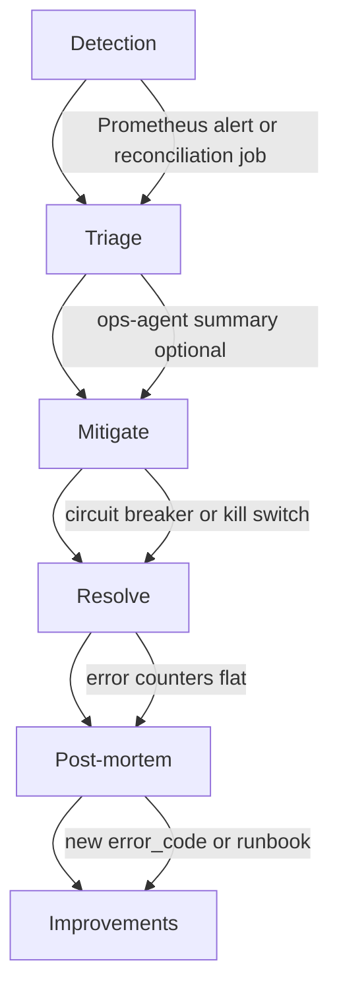

# Phase 5 — Incident Lifecycle and Operations

Date: 2026-06-07  
Repository: `microservices-trading-bot`

## 1) Objective

Plan the **operational workflow** for Error Engine errors: detection through post-mortem, runbook templates, ops-agent integration, escalation, and rollback playbooks.

**Prerequisites:** Phases 3–4

**Next:** [`PHASE-6-ROLLOUT-VERIFICATION-AND-GATES-2026-06-07.md`](PHASE-6-ROLLOUT-VERIFICATION-AND-GATES-2026-06-07.md)

---

## 2) Incident lifecycle



| Stage | Owner | Inputs | Outputs |
|-------|-------|--------|---------|
| **Detection** | Monitoring | Alerts, SLO breach, reconciliation delta | Alert with `error_code` |
| **Triage** | On-call / ops-agent | Metrics, logs, correlation_id | Severity confirmation, impacted book/strategy |
| **Mitigate** | On-call | Runbook, kill switches | Breaker engaged; customer impact stopped |
| **Resolve** | Engineering | Root cause fix or config | Deploy; counters flat |
| **Post-mortem** | Engineering + ops | Timeline, error records | `docs/incident-reports/` doc |
| **Improvements** | Engineering | Post-mortem actions | New code, alert, or runbook section |

**Target MTTR:**

| Severity | Acknowledge | Mitigate | Resolve |
|----------|-------------|----------|---------|
| P0 | 15 min | 30 min | 4 h (workaround) |
| P1 | 30 min | 2 h | 24 h |
| P2 | Best effort | Next business day | Next sprint |

---

## 3) Escalation matrix

| Level | Severity (typical) | Notify | Channel | Auto-actions allowed |
|-------|-------------------|--------|---------|----------------------|
| **red** | P0 | On-call + trading lead | Pager / critical Slack | Circuit breakers only (no auto trade) |
| **yellow** | P1, P2 | On-call | Warning Slack | Retry/backoff; router pause |
| **green** | P3, expected P2 | Dashboard | Grafana / logs | None |

**Escalation path:** yellow sustained → red (alert threshold) → on-call → trading lead → engineering manager (red unresolved > 1h).

Legacy severity-based MTTR targets (Phase 5 §2) remain for engineering; operators use **level** first.

---

## 4) Runbook template (per error_code)

Extend pattern from `docs/runbooks/LIMIT-PROFIT-RUNBOOK.md`.

File naming: `docs/runbooks/error-engine/{ERROR_CODE}.md` (future) or section in service runbook.

### Template

```markdown
# Runbook: {ERROR_CODE}

**Level:** green | yellow | red  
**Severity:** P0 | P1 | P2  
**Domain:** venue | kafka | ...  
**Financial impact:** none | potential | confirmed  

## Symptoms
- Alert: `{AlertName}`
- Metrics: `{promql}`
- Logs: `{fields to grep}`

## Immediate actions (first 5 minutes)
1. ...
2. Check kill switch: `DRY_RUN`, strategy stop, ...

## Diagnosis
| Check | Command / query | Expected |
|-------|-----------------|----------|
| ... | ... | ... |

## Mitigation
- Circuit breaker: ...
- Rollback: ...

## Resolution verification
- [ ] `{error_code}` counter flat 30m
- [ ] Reconciliation delta zero
- [ ] Soak checklist item ...

## Related
- Incident: `docs/incident-reports/...`
- Code: `services/...`
```

### Priority runbooks to author (Phase 6)

| error_code | Rationale |
|------------|-----------|
| `OM_SYNC_AVG_PRICE_MISMATCH` | Historical P0 incident |
| `FIN_RECONCILIATION_DELTA` | Financial integrity |
| `TE_BALANCE_FETCH_ERROR` | Blocks trading |
| `SR_EVALUATION_ERROR` | Router soak failures |
| `SE_INDICATOR_STALE` | Bar-first production |
| `MD_WEBSOCKET_ERROR` | Upstream of all strategies |

---

## 5) Incident report template

Extend `docs/incident-reports/order-management/ORDER-MANAGEMENT-BITSO-AVG-PRICE-DISCREPANCY-2026-05-16.md`.

Required sections:

1. Summary (severity, status, component)
2. Symptoms (table with examples)
3. Root cause (file/function reference)
4. Timeline (UTC, correlation_ids)
5. Error codes involved
6. Implemented solution + commit
7. Verification checklist
8. Error Engine follow-ups (new alert, runbook, code)

Store under: `docs/incident-reports/{component}/{TITLE-YYYY-MM-DD}.md`

---

## 6) ops-agent integration

Per `docs/agentic-ai/AGENTIC-AI-INTEGRATION-PLAN-2026-05-07.md` — agents assist triage; they do not compute P&L.

### 6.1 Structured error artifact (planned)

JSON bundle consumed by ops-agent tools:

```json
{
  "artifact_type": "error_summary",
  "window_minutes": 15,
  "errors": [
    {
      "error_code": "OM_SYNC_BITSO_API_ERROR",
      "level": "yellow",
      "severity": "P1",
      "count": 12,
      "last_occurrence": "2026-06-07T12:00:00Z",
      "sample_correlation_ids": ["..."],
      "books": ["btc_mxn"]
    }
  ],
  "reconciliation_delta": null,
  "platform_error_level": "yellow",
  "operating_mode": "degraded"
}
```

### 6.2 New tools (future)

| Tool | Purpose |
|------|---------|
| `error_summary_query` | Fetch recent errors by severity/code |
| `reconciliation_report_fetch` | Load Layer A artifact by run ID |
| `runbook_lookup` | Map `error_code` → runbook URL (already planned in agentic plan) |

### 6.3 Alertmanager webhook flow

1. Alert fires with `error_code` label
2. Webhook → ops-agent (optional auto-triage)
3. Agent queries Prometheus + error summary
4. Operator receives narrative + recommended runbook steps
5. **Human approves** mitigation actions

Read-only default preserved (`services/ops-agent/cmd/main.go` policy).

### 6.4 agent-coordinator role

- Fan-out: venue specialist + strategy specialist agents (future)
- Aggregate single operator report
- Apply global token/cost budget (`shared/pkg/agent/policy.go`)

---

## 7) Rollback playbooks

Reference: `docs/strategy-fee-accuracy/STAGE-EXECUTION-SOAK-OPERATOR-GUIDE-2026-06-04.md` § Incident rollback.

### Fast rollback (< 5 min)

```bash
# Router dry-run
kubectl -n bitso-trading-dev set env deployment/strategy-router DRY_RUN=true

# Engine dry-run (if exposed)
kubectl -n bitso-trading-dev set env deployment/trading-engine DRY_RUN=true

# Stop active strategy
curl -X POST http://localhost:8081/api/v1/strategies/limit_profit/stop
```

### Post-rollback verification

- [ ] No new Bitso orders in venue UI
- [ ] `strategy_router_evaluation_errors_total` stable or explained
- [ ] Open positions documented; manual close plan if needed

Link rollback steps to P0/P1 runbooks.

---

## 8) Audit store (optional v1.1)

For P0/P1 errors, persist envelope to durable store:

| Field | Storage |
|-------|---------|
| Full context envelope | PostgreSQL or S3 JSON lines |
| Retention | 90d minimum (financial audit) |
| Query | By `correlation_id`, `order_id`, `error_code`, time range |

Enables post-incident replay without log aggregation dependency.

**v1:** structured logs + Prometheus sufficient; audit store in Phase 6+ if required.

---

## 9) Communication templates

### Red operator message

```
[RED] {error_code} — {book}
Impact: {financial_impact description}
Action: {first runbook step}
Correlation: {id}
Dashboard: {Grafana traffic-light panel}
Runbook: docs/runbooks/error-engine/{code}.md
```

### Yellow operator message

```
[YELLOW] {error_code} — {book}
Watch: sustained rate or escalation to RED if {threshold}
Action: {first runbook step}
```

### Post-mortem distribution

- Engineering + ops within 48h of P0 resolve
- Link error codes and new alerts in post-mortem doc

---

## 10) Exit criteria (Phase 5 complete)

- [x] Incident lifecycle documented
- [x] Escalation matrix defined
- [x] Runbook and incident templates specified
- [x] ops-agent integration plan documented
- [x] Rollback playbook linked
- [ ] Runbooks authored for priority error codes (Phase 6)
- [ ] Alertmanager → ops-agent webhook tested (Phase 6)
- [ ] Audit store decision recorded (optional)
