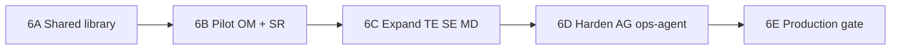

# Phase 6 — Rollout, Verification, and Gates

Date: 2026-06-07  
Repository: `microservices-trading-bot`

## 1) Objective

Define the **implementation and rollout roadmap** for the Error Engine: pilot services, expansion order, verification gates, and exit criteria before Production promotion.

This phase covers **future code and infra work** referenced in Phases 1–5.

**Prerequisites:** Phases 1–5

---

## 2) Implementation roadmap overview



| Stage | Scope | Deliverables |
|-------|-------|--------------|
| **6A** | Foundation | `shared/pkg/errortracking`, context propagation spec in Kafka/HTTP |
| **6B** | Pilot | order-management + strategy-router emit structured errors + normalized metrics |
| **6C** | Expand | trading-engine, strategy-executor, market-data |
| **6D** | Harden | api-gateway, backtesting, ops-agent error artifact tools |
| **6E** | Production gate | Stage soak, alert drill, operator sign-off |

---

## 3) Stage 6A — Shared library foundation

### Tasks

1. Create `shared/pkg/errortracking` with `Error`, `Context`, `Record()` API (Phase 2 sketch)
2. Add `CorrelationID` to `context.Context` helpers
3. Document Kafka/HTTP propagation in `shared/pkg/models/events.go` (schema version bump)
4. Unit tests for classification and metric label cardinality

### Exit criteria

- [ ] Library merged with ≥ 80% test coverage on classification helpers
- [ ] No service adoption required yet
- [ ] ADR or comment in README linking to `docs/error-engine/`

---

## 4) Stage 6B — Pilot: order-management + strategy-router

**Rationale:** Highest incident history (avg-price discrepancy, sync paths) and existing soak metrics (`strategy_router_evaluation_errors_total`).

### order-management

| Task | Detail |
|------|--------|
| Wrap sync errors | `RecordBitsoSyncError` → `OM_SYNC_BITSO_API_ERROR` |
| Defer path | Emit `OM_SYNC_TRADES_DEFERRED` (log + metric) |
| User-trades poller | Map to `OM_USER_TRADES_POLL_ERROR` |
| Heuristic alert | Limit == avg on filled order → `OM_SYNC_AVG_PRICE_MISMATCH` |
| Add metric vec | `order_management_errors_total{error_code, domain, severity, level, book}` |

### strategy-router

| Task | Detail |
|------|--------|
| Evaluation errors | Map to `SR_EVALUATION_ERROR` with correlation_id |
| Snapshot unhealthy | `SR_SNAPSHOT_UNHEALTHY` when classifier degrades |
| Audit log | Structured JSON in `audit.go` |
| Preserve behavior | Skip cycle on transient errors (no change) |

### Monitoring (pilot)

- Add `error-engine-venue` and `error-engine-financial` rule groups to `k8s/monitoring/prometheus-rules.yaml` (subset)
- Grafana row on existing strategy-router dashboard

### Pilot soak (Stage)

Duration: **48–72 h** (align with classification soak pattern — `docs/strategy-fee-accuracy/STAGE-SOAK-OPERATOR-GUIDE-2026-06-02.md`)

| Check | Pass |
|-------|------|
| Normalized error metrics scrape | All pilot targets up |
| Legacy counters still present | No dashboard regression |
| `SR_EVALUATION_ERROR` rate | Consistent with legacy counter |
| P0 alerts | None firing in steady state |
| Platform level gauge | `trading_platform_error_level` green in steady state |
| Runbooks | Draft for pilot codes (include level in header) |

---

## 5) Stage 6C — Expand: trading-engine, strategy-executor, market-data

### trading-engine

- Map balance, Kafka, publish errors to Phase 2 codes
- Pretrade rejects → `TE_PRETRADE_RISK_VIOLATION` with reason label
- Trading halt on balance fetch burst (circuit breaker Phase 4)

### strategy-executor

- Unify zerolog with error envelope
- Map `RecordStrategyError` / `RecordMarketDataError` to catalog
- `SE_INDICATOR_STALE` tied to bar-first health

### market-data

- WS/subscribe/storage/historical → MD_* codes
- Link to router pause when bars stale

### Expand soak

- Run execution soak (`STAGE-EXECUTION-SOAK-OPERATOR-GUIDE-2026-06-04.md`) with error dashboard watch
- Pass: flat P0 counters; P1 alerts only on injected failures

---

## 6) Stage 6D — Harden: api-gateway, backtesting, ops-agent

### api-gateway

- Backend errors → `AG_BACKEND_*` with correlation_id from ingress

### backtesting

- Lower priority; map `data_fetch_errors_total` for consistency

### ops-agent

- Implement `error_summary_query` tool (Phase 5)
- Optional Alertmanager webhook handler
- Feed reconciliation artifact when Layer A job exists

---

## 7) Stage 6E — Production promotion gate

All must pass before Production:

| Gate | Verification |
|------|--------------|
| Error code coverage | 100% of classified failure paths in hot-path services emit structured errors |
| Alert drill | Inject P1 in Stage; alert fires within 2m; runbook followed |
| Financial SLO | Zero confirmed reconciliation deltas in 7d Stage soak |
| Runbooks | P0/P1 codes have runbook in `docs/runbooks/error-engine/` |
| Rollback tested | `DRY_RUN` rollback < 5 min (`STAGE-EXECUTION-SOAK-OPERATOR-GUIDE`) |
| Operator sign-off | Trading lead + on-call acknowledge Error Engine dashboard |
| Dual metrics sunset plan | Date to remove legacy unlabeled counters |

---

## 8) Verification checklist (copy for Stage ops)

```markdown
## Error Engine Stage Verification — {date}

### Metrics
- [ ] `order_management_errors_total` scraping (includes `level` label)
- [ ] `strategy_router_errors_total` scraping
- [ ] `trading_platform_error_level` shows green in steady state
- [ ] Legacy counters flat in steady state

### Alerts
- [ ] `RouterEvaluationsFailing` armed
- [ ] `BitsoSyncErrorsSustained` armed (if implemented)
- [ ] No spurious P0 in 24h

### Financial
- [ ] Fill VWAP path verified post-deploy
- [ ] Fee drift alert tested or documented N/A
- [ ] Reconciliation job: {status}

### Operations
- [ ] Runbooks linked from Grafana
- [ ] ops-agent error summary: {status}
- [ ] Rollback drill completed

### Sign-off
- Operator: _______________  Date: _______________
```

---

## 9) Timeline estimate (engineering)

| Stage | Effort | Dependency |
|-------|--------|------------|
| 6A Shared library | 3–5 days | — |
| 6B Pilot | 5–8 days | 6A |
| 6C Expand | 8–12 days | 6B soak pass |
| 6D Harden | 5–7 days | 6C |
| 6E Gate + soak | 7–14 days wall clock | 6D |

Total: **~6–8 weeks** calendar with Stage soaks between stages.

---

## 10) Out of scope reminder

Not included in Error Engine v1 (may be v2):

- OpenTelemetry full rollout
- Dedicated error-ingestion microservice
- Autonomous remediation without human approval
- LLM-based error classification

---

## 11) Success metrics (6 months post-Production)

| Metric | Target |
|--------|--------|
| P0 MTTR | < 30 min mitigate |
| Unclassified 5xx incidents | ↓ 50% |
| Incidents with `error_code` in post-mortem | 100% |
| Manual log stitching time | ↓ 70% |
| Reconciliation surprises | 0 undetected > 1h |

---

## 12) Exit criteria (Phase 6 planning complete)

- [x] Rollout stages 6A–6E defined
- [x] Pilot service selection justified
- [x] Stage verification checklist provided
- [x] Production gate criteria documented
- [x] Timeline estimate provided
- [ ] Stage 6A implementation started (future engineering work)

**Planning complete.** Return to [`README.md`](README.md) for document index.
