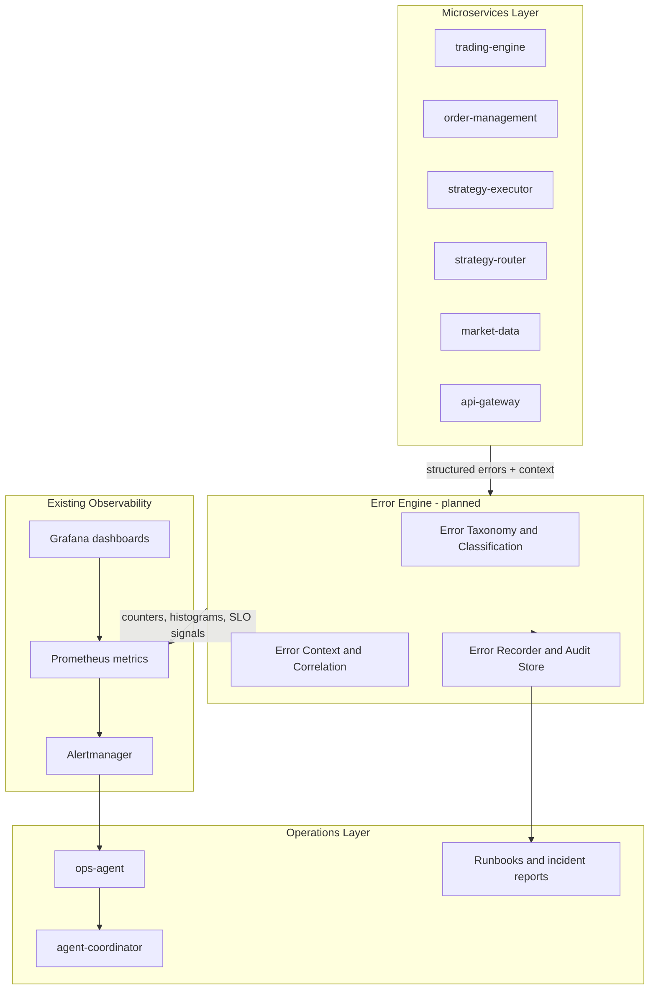

# Error Engine — Phased Planning Documentation

Date: 2026-06-07  
Repository: `microservices-trading-bot`

## Start here

This folder plans a **production-grade Error Engine** for the Bitso microservices trading platform. The engine is **not implemented yet** — these documents define the phased plan for error **tracking**, **monitoring**, **classification**, and **financial-industry operational requirements** (auditability, deterministic truth, kill switches, reconciliation).

**What the Error Engine is:**

- A unified error taxonomy and context model across all trading services
- Standardized observability (metrics, alerts, SLOs) tied to stable error codes
- Financial-integrity error classes with circuit breakers and reconciliation gates
- An operational lifecycle (detection → triage → mitigation → post-mortem) integrated with existing runbooks and ops-agent tooling

**What it is not (yet):**

- A deployed service or shared library in this repository
- A replacement for deterministic P&L or venue sync code (see `docs/agentic-ai/AGENTIC-AI-PRODUCTION-STRATEGY-2026-05-13.md`)
- An autonomous remediation system — human-in-the-loop remains required for state-changing actions

---

## Phase map

| Phase | Document | Focus | Status | Depends on |
|-------|----------|-------|--------|------------|
| 1 | [`PHASE-1-FOUNDATIONS-AND-GAP-ANALYSIS-2026-06-07.md`](PHASE-1-FOUNDATIONS-AND-GAP-ANALYSIS-2026-06-07.md) | Current state, gaps, guiding principles | Planned | — |
| 2 | [`PHASE-2-ERROR-MODEL-AND-CLASSIFICATION-2026-06-07.md`](PHASE-2-ERROR-MODEL-AND-CLASSIFICATION-2026-06-07.md) | Taxonomy, context envelope, error codes | Planned | Phase 1 |
| 3 | [`PHASE-3-OBSERVABILITY-TRACKING-AND-ALERTING-2026-06-07.md`](PHASE-3-OBSERVABILITY-TRACKING-AND-ALERTING-2026-06-07.md) | Metrics, alerts, SLOs, dashboards | Planned | Phase 2 |
| 4 | [`PHASE-4-FINANCIAL-VENUE-AND-RISK-ERRORS-2026-06-07.md`](PHASE-4-FINANCIAL-VENUE-AND-RISK-ERRORS-2026-06-07.md) | Financial error classes, circuit breakers | Planned | Phases 2–3 |
| 5 | [`PHASE-5-INCIDENT-LIFECYCLE-AND-OPERATIONS-2026-06-07.md`](PHASE-5-INCIDENT-LIFECYCLE-AND-OPERATIONS-2026-06-07.md) | Runbooks, ops-agent, escalation | Planned | Phases 3–4 |
| 6 | [`PHASE-6-ROLLOUT-VERIFICATION-AND-GATES-2026-06-07.md`](PHASE-6-ROLLOUT-VERIFICATION-AND-GATES-2026-06-07.md) | Pilot order, exit criteria, future implementation | Planned | Phases 1–5 |

Read phases in order. Phase 1 establishes why the engine is needed; Phase 6 defines how to ship it safely.

---

## Architecture (planned)

---

## Service error ownership

Each service owns emission of structured errors for its domain. The Error Engine provides the shared contract; services remain responsible for business logic and recovery.

| Service | Path | Primary error domains |
|---------|------|----------------------|
| trading-engine | `services/trading-engine/` | Pre-trade risk, order execution, Kafka publish, balance fetch |
| order-management | `services/order-management/` | Bitso sync, user-trades poll, session risk, fill reconciliation |
| strategy-executor | `services/strategy-executor/` | Strategy runtime, market-data consumer, signal publish, indicators |
| strategy-router | `services/strategy-router/` | Regime evaluation, snapshot fetch, strategy start/stop |
| market-data | `services/market-data/` | WebSocket, storage, historical fetch, API |
| api-gateway | `services/api-gateway/` | Backend proxy errors, auth, rate limits |
| ops-agent | `services/ops-agent/` | Agent runtime, tool failures, budget violations |
| agent-coordinator | `services/agent-coordinator/` | Fan-out failures, policy rejections |
| backtesting | `services/backtesting/` | Data fetch, simulation errors (non-production path) |

---

## Related documentation

| Area | Location |
|------|----------|
| Incident post-mortems | [`docs/incident-reports/`](../incident-reports/) |
| Operator runbooks | [`docs/runbooks/`](../runbooks/) |
| Agentic AI / ops integration | [`docs/agentic-ai/`](../agentic-ai/) |
| Fee accuracy & regime routing | [`docs/strategy-fee-accuracy/`](../strategy-fee-accuracy/) |
| Financial strategy framework | [`docs/FINANCIAL-STRATEGY-IMPLEMENTATION-GUIDE.md`](../FINANCIAL-STRATEGY-IMPLEMENTATION-GUIDE.md) |
| Prometheus alert rules | [`k8s/monitoring/prometheus-rules.yaml`](../../k8s/monitoring/prometheus-rules.yaml) |
| ServiceMonitor config | [`k8s/monitoring/servicemonitors.yaml`](../../k8s/monitoring/servicemonitors.yaml) |

---

## TL;DR

1. **Today:** errors are tracked per-service via ad-hoc Prometheus counters and unstructured logs — sufficient for Stage soak but not for unified financial-integrity monitoring.
2. **Plan:** introduce stable error codes, a shared context envelope, normalized metrics, financial alert classes, and an incident lifecycle wired to ops-agent and runbooks.
3. **Ship order:** order-management + strategy-router pilot → trading-engine + strategy-executor + market-data → api-gateway + backtesting + ops-agent feed (see Phase 6).
