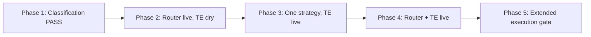

# Stage Execution Soak — Operator Guide

Date: 2026-06-04  
Repository: `microservices-trading-bot`  
Related: [`STAGE-SOAK-OPERATOR-GUIDE-2026-06-02.md`](STAGE-SOAK-OPERATOR-GUIDE-2026-06-02.md), [`STAGE-SOAK-VERIFICATION-2026-06-03.md`](STAGE-SOAK-VERIFICATION-2026-06-03.md), [`STAGE-SOAK-MARKET-DATA-ATR-OBSERVATIONS-2026-06-03.md`](STAGE-SOAK-MARKET-DATA-ATR-OBSERVATIONS-2026-06-03.md), [`../ORDER-FLOW-AND-BITSO-TESTING.md`](../ORDER-FLOW-AND-BITSO-TESTING.md)

## Purpose

The **classification soak** (POST-POINT-10 item 1) validates that bash and Go routers assign the same `regime` label on live indicators — **without** starting strategies or placing Bitso orders.

The **Stage execution soak** (this document) validates the **full trading path** on Bitso Stage:

1. **Strategy routing** — `strategy-router` may `start`/`stop` strategies from regime decisions (guardrails apply).
2. **Signal generation** — running strategies emit signals on `trading.signals`.
3. **Order placement** — `trading-engine` calls Bitso Stage REST (`PlaceOrder`).
4. **Order lifecycle** — `order-management` records placed orders and syncs fills from Stage.
5. **Fee honesty** — realized fees on fills match strategy P&L (POINT-9 / POINT-11).

This is **not** a substitute for the classification soak. Complete item 1 (≥ 99% bash↔Go regime agreement over 24–48 h) **before** enabling router lifecycle and live engine orders, unless you deliberately isolate execution testing on a separate book/namespace.

| Soak | Primary metric | `strategy-router` | `trading-engine` | Strategies |
|------|----------------|-------------------|------------------|------------|
| Classification (item 1) | Regime agreement ≥ 99% | `DRY_RUN=true` | N/A (not in path) | Registered, **stopped** |
| Execution (this doc) | Safe Stage round-trips + routing | Phased → `false` | Phased → live | **Running** when routed |

---

## Prerequisites (hard gates)

Complete **before** Phase 3+ of this guide:

- [x] Classification short soak **PASS** — see [`STAGE-SOAK-VERIFICATION-2026-06-07.md`](STAGE-SOAK-VERIFICATION-2026-06-07.md) (`live_agreement_rate = 1.0`, 140/140 samples, ~69.8 h elapsed; verified 2026-06-07).
- [ ] `market-data` with `GET /api/v1/bars`; ATR warm-up ≥ 15 min on book ([`STAGE-SOAK-MARKET-DATA-ATR-OBSERVATIONS-2026-06-03.md`](STAGE-SOAK-MARKET-DATA-ATR-OBSERVATIONS-2026-06-03.md)).
- [ ] Strategies registered with **canonical** names matching `ROUTE_*` (`mean_reversion_btc_mxn`, `momentum_btc_mxn`, `limit_profit_btc_mxn`):
  ```bash
  ./scripts/run-stage-soak-2026-06-02.sh register
  ```
- [ ] Bash parallel router **stopped** before router goes live:
  ```bash
  ./scripts/run-stage-soak-2026-06-02.sh stop-bash
  ```
- [ ] Stage API secrets present in cluster (`STAGE_BITSO_API_KEY`, `STAGE_BITSO_API_SECRET` on `trading-engine` and `order-management`).
- [ ] `BITSO_API_BASE_URL=https://stage.bitso.com/api` (default in dev base).
- [ ] Optional but recommended: Stage-aligned WebSocket for indicators — `bitso-ws-url: wss://ws.stage.bitso.com` in development overlay (see observations doc §5).

---

## `DRY_RUN` — three independent switches

Misconfiguring any one layer produces a false sense of “live” trading.

| Layer | Location | `true` | `false` (live behavior) |
|-------|----------|--------|-------------------------|
| Router lifecycle | `strategy-router` env `DRY_RUN` | Classify only; no `start`/`stop` | May switch strategies per regime |
| Engine orders | `trading-engine` env `DRY_RUN` | Log “Would place…”; **no** Bitso API | `PlaceOrder` on `BITSO_API_BASE_URL` |
| Signal metadata | Strategy param `dry_run` (via `start-organic-trading.sh`) | Engine should skip even if engine `DRY_RUN` unset | Normal execution path |

**Rule:** `DRY_RUN=false` on the router **does not** place orders. Live Stage orders require **all three** aligned for the path you are testing:

- Router `DRY_RUN=false` → only for **routing soak** (Phases 2–4).
- Engine `DRY_RUN` unset/false → only for **order soak** (Phases 3–4).
- Register/start strategies **without** `DRY_RUN=true` on `start-organic-trading.sh` when testing real fills.

Confirm engine mode:

```bash
kubectl -n bitso-trading-dev exec deploy/trading-engine -- \
  wget -qO- http://127.0.0.1:8080/metrics 2>/dev/null | grep '^trading_engine_dry_run'
# Expect: trading_engine_dry_run 0 for live Bitso calls
```

---

## Phased rollout (recommended)

Run phases in order. Do not skip Phase 1 if classification soak is still open.



### Phase 1 — Classification gate (existing soak)

**Goal:** ≥ 99% bash↔Go regime agreement; flat `strategy_router_evaluation_errors_total`.

```bash
./scripts/run-stage-soak-2026-06-02.sh check
./scripts/run-stage-soak-2026-06-02.sh sample   # cron every 30 min
./scripts/run-stage-soak-2026-06-02.sh report
```

**Pass:** `live_agreement_rate ≥ 0.99` in report output — **achieved 2026-06-07** (see [`STAGE-SOAK-VERIFICATION-2026-06-07.md`](STAGE-SOAK-VERIFICATION-2026-06-07.md)).

**Proceed to Phase 2** via `./scripts/run-stage-execution-soak-2026-06-04.sh phase2-start`.

---

### Phase 2 — Router lifecycle only (no Bitso orders)

**Goal:** Verify `start`/`stop`, cooldown, `has_position`, `not_registered`, and `high_vol` → pause without placing orders.

| Component | Setting |
|-----------|---------|
| `strategy-router` | `DRY_RUN=false` |
| `trading-engine` | `DRY_RUN=true` (set explicitly for this phase) |
| Strategies | Registered; router may start/stop per regime |

**Enable router lifecycle:**

1. Prefer the helper (stops bash soak, sets env, records window):
   ```bash
   ./scripts/run-stage-execution-soak-2026-06-04.sh phase2-start
   ./scripts/run-stage-execution-soak-2026-06-04.sh phase2-status
   ```
   Or edit `k8s/overlays/development/strategy-router-soak.yaml` — set `DRY_RUN` to `"false"`, **or** patch:
   ```bash
   kubectl -n bitso-trading-dev set env deployment/strategy-router DRY_RUN=false
   kubectl -n bitso-trading-dev rollout status deploy/strategy-router
   ```
2. Set trading-engine dry-run (dev overlay patch or one-off):
   ```bash
   kubectl -n bitso-trading-dev set env deployment/trading-engine DRY_RUN=true
   kubectl -n bitso-trading-dev rollout status deploy/trading-engine
   ```
3. Stop bash router if still running:
   ```bash
   ./scripts/run-stage-soak-2026-06-02.sh stop-bash
   ```

**Observe (24 h minimum):**

```bash
kubectl -n bitso-trading-dev port-forward svc/strategy-router 8092:8092 &
curl -s http://127.0.0.1:8092/api/v1/router/state | jq '{
  dry_run, routes,
  last: .last_decisions[0] | {regime, action, current, preferred, reason}
}'
```

| Signal | Healthy |
|--------|---------|
| `strategy_router_evaluations_total` rate | ≈ 1 / `ROUTER_INTERVAL_SEC` |
| `strategy_router_evaluation_errors_total` | Flat |
| `strategy_router_blocked_total{reason="not_registered"}` | Zero after canonical registration |
| `strategy_router_blocked_total{reason="has_position"}` | Expected when switching with open position |
| `strategy_router_blocked_total{reason="dry_run"}` | **Zero** (router no longer dry) |
| Executor: at most one MR/momentum running per book | Matches `preferred` for stable regime |

**Pull Go audit before pod restart:**

```bash
./scripts/analyze-stage-soak-agreement.sh pull-go
```

---

### Phase 3 — Single-strategy order path (router still dry or manual start)

**Goal:** One controlled Stage round-trip through Kafka → engine → Bitso → order-management.

| Component | Setting |
|-----------|---------|
| `strategy-router` | `DRY_RUN=true` **or** router stopped; **manual** `start` one strategy |
| `trading-engine` | `DRY_RUN` **unset** or `false` |
| Strategies | **One** running (e.g. `mean_reversion_btc_mxn`); minimal `position_size` |

**Pre-flight:**

```bash
# Secrets and stage URL (from pod env)
kubectl -n bitso-trading-dev exec deploy/trading-engine -- env | grep -E 'BITSO_API|STAGE_BITSO|DRY_RUN|ORDER_MANAGEMENT'

# Engine not in dry-run
kubectl -n bitso-trading-dev exec deploy/trading-engine -- \
  wget -qO- http://127.0.0.1:8080/metrics | grep '^trading_engine_dry_run'
```

**Start one strategy manually:**

```bash
kubectl -n bitso-trading-dev exec deploy/strategy-executor -- \
  wget -qO- --post-data='' http://127.0.0.1:8081/api/v1/strategies/mean_reversion_btc_mxn/start
```

**Validate order flow** (see [`../ORDER-FLOW-AND-BITSO-TESTING.md`](../ORDER-FLOW-AND-BITSO-TESTING.md)):

1. **trading-engine** logs — `Successfully placed BUY order <oid>` (not `[DRY-RUN] Would place`).
2. **order-management** logs — `Recorded order placed` with `bitso_order_id`.
3. **Bitso Stage dashboard** — order ID matches engine log.
4. **Fill sync** — OM status moves `submitted` → `filled` (sync job needs stage keys on OM).
5. **Fee honesty** — on first complete round-trip:
   - Kafka `trading.order.fills` (or OM fill events) include `fee_rate` / liquidity.
   - Strategy logs show net P&L using **realized** legs ([`POST-POINT-10-IMPLEMENTATION-STATUS-2026-05-25.md`](POST-POINT-10-IMPLEMENTATION-STATUS-2026-05-25.md) operator step 4).

**Optional scripted check** (port-forwards required):

```bash
kubectl -n bitso-trading-dev port-forward svc/strategy-executor 8084:8081 &
kubectl -n bitso-trading-dev port-forward svc/trading-engine 8086:8080 &
kubectl -n bitso-trading-dev port-forward svc/order-management 8087:8082 &
./scripts/e2e-trading-flow-test.sh
```

**Stop strategy after spot-check:**

```bash
kubectl -n bitso-trading-dev exec deploy/strategy-executor -- \
  wget -qO- --post-data='' http://127.0.0.1:8081/api/v1/strategies/mean_reversion_btc_mxn/stop
```

---

### Phase 4 — Router-managed execution (full stack)

**Goal:** Regime-driven `start`/`stop` with live engine orders on Stage for ≥ 24–48 h.

| Component | Setting |
|-----------|---------|
| `strategy-router` | `DRY_RUN=false` |
| `trading-engine` | `DRY_RUN` unset/false |
| `ROUTE_*` | Canonical names in `strategy-router-soak.yaml` |
| Bash router | **Stopped** |

**Guardrails in production path:**

| Guardrail | Default | Execution impact |
|-----------|---------|------------------|
| `COOLDOWN_SECS` | `120` | Limits strategy churn |
| `has_position` | on | Blocks switch while position open |
| `ROUTE_HIGH_VOL` | `none` | Pauses entries in high vol |
| Session risk (OM) | configured | Engine may reject signals |

**Watch during soak:**

- Grafana `strategy-router` dashboard — regime, blocks, errors.
- `orders_executed_total` / `orders_failed_total` on trading-engine.
- `session_risk_rejections_total` — should stay low with conservative sizing.
- No duplicate strategies running on same book after switches.

**Incident rollback (fast):**

```bash
# Stop autonomous routing
kubectl -n bitso-trading-dev set env deployment/strategy-router DRY_RUN=true
# Stop Bitso placement
kubectl -n bitso-trading-dev set env deployment/trading-engine DRY_RUN=true
# Stop all strategies
kubectl -n bitso-trading-dev exec deploy/strategy-executor -- \
  wget -qO- http://127.0.0.1:8081/api/v1/strategies | jq -r '.strategies[] | select(.running) | .name' | while read -r n; do
  kubectl -n bitso-trading-dev exec deploy/strategy-executor -- \
    wget -qO- --post-data='' "http://127.0.0.1:8081/api/v1/strategies/${n}/stop"
done
```

---

### Phase 5 — Extended execution gate (optional milestone)

After Phase 4 short soak (24–48 h) with no critical incidents:

- Maintain router + live engine for **≥ 7 days** (mirrors classification extended gate).
- Log regime distribution, switch count, order count, failed orders, fee drift alerts.
- Re-run `./scripts/run-stage-soak-2026-06-02.sh sample` periodically to ensure classifier has not drifted.

---

## Environment parameters (execution-specific)

### trading-engine

| Variable | Purpose |
|----------|---------|
| `DRY_RUN` | `true`/`1` = no Bitso calls |
| `BITSO_API_BASE_URL` | Default `https://stage.bitso.com/api` |
| `STAGE_BITSO_API_KEY` / `STAGE_BITSO_API_SECRET` | Stage credentials |
| `ORDER_MANAGEMENT_URL` | Session risk pre-trade (e.g. `http://order-management:8082`) |
| `KAFKA_TOPIC_ORDERS_PLACED` | Default `trading.orders.placed` |

### order-management

| Variable | Purpose |
|----------|---------|
| `STAGE_BITSO_API_KEY` / `STAGE_BITSO_APISECRET` | Bitso sync job (`LookupOrders`) |
| `KAFKA_TOPIC_ORDERS_PLACED` | Must match trading-engine |
| `BITSO_API_BASE_URL` | Stage REST |

### strategy-router

| Variable | Purpose |
|----------|---------|
| `DRY_RUN` | `false` for Phase 2+ routing |
| `ROUTE_*` | Must match registered strategy **names** |
| `COOLDOWN_SECS` | Min seconds between switches |
| `ROUTER_INTERVAL_SEC` | Poll interval (default 30) |

### market-data (Stage alignment)

| Variable | Purpose |
|----------|---------|
| `BITSO_WS_URL` | Prefer `wss://ws.stage.bitso.com` for Stage-aligned indicators |

---

## Pass / fail checklist (execution soak)

| Criterion | Pass | Fail → action |
|-----------|------|----------------|
| Classification gate | ≥ 99% bash↔Go (item 1) | Finish [`STAGE-SOAK-OPERATOR-GUIDE-2026-06-02.md`](STAGE-SOAK-OPERATOR-GUIDE-2026-06-02.md) |
| Engine dry-run gauge | `trading_engine_dry_run 0` when testing orders | Unset `DRY_RUN` on trading-engine; rollout |
| Stage order placed | Engine log + Stage dashboard OID match | Check API keys, OM URL, signal path |
| OM record | `bitso_order_id` in OM | Kafka topic alignment; OM logs |
| Fill sync | Status progresses to `filled` | OM stage secrets; sync job logs |
| Fee honesty | Realized `fee_rate` on first round-trip | [`POINT-9-REALIZED-FEES.md`](POINT-9-REALIZED-FEES.md), POINT-11 |
| Router blocks | No sustained `not_registered` | Align `ROUTE_*` with canonical names |
| Router errors | Flat `evaluation_errors_total` | Executor URL, snapshot health |
| Unsafe switching | No two strategies trading same book | Cooldown + `has_position`; review audit log |
| Rollback tested | `DRY_RUN=true` on router + engine < 5 min | Practice incident commands above |

---

## What this soak does **not** validate

- Production Bitso API or production WebSocket.
- P&L profitability or strategy parameter optimality.
- Full `limit_profit` organic LP lifecycle at scale (run dedicated LP soak if needed).
- `agent-coordinator` threshold tuning (deferred in POST-POINT-10).

---

## Related documents

- [`STAGE-FINANCIAL-APPROACH-2026-06-04.md`](STAGE-FINANCIAL-APPROACH-2026-06-04.md) — **single reference**: engineering vs economic proof, priorities, decision tree
- [`STAGE-SOAK-OPERATOR-GUIDE-2026-06-02.md`](STAGE-SOAK-OPERATOR-GUIDE-2026-06-02.md) — classification soak (item 1)
- [`STAGE-SOAK-VERIFICATION-2026-06-07.md`](STAGE-SOAK-VERIFICATION-2026-06-07.md) — classification PASS (2026-06-07)
- [`scripts/run-stage-execution-soak-2026-06-04.sh`](../../scripts/run-stage-execution-soak-2026-06-04.sh) — execution soak helper
- [`STAGE-SOAK-MARKET-DATA-ATR-OBSERVATIONS-2026-06-03.md`](STAGE-SOAK-MARKET-DATA-ATR-OBSERVATIONS-2026-06-03.md) — `DRY_RUN`, Stage WS, ATR
- [`../ORDER-FLOW-AND-BITSO-TESTING.md`](../ORDER-FLOW-AND-BITSO-TESTING.md) — order pipeline validation
- [`POST-POINT-10-IMPLEMENTATION-STATUS-2026-05-25.md`](POST-POINT-10-IMPLEMENTATION-STATUS-2026-05-25.md) — milestone gate
- [`STRATEGY-REGIME-ROUTER-SERVICE-2026-05-22.md`](STRATEGY-REGIME-ROUTER-SERVICE-2026-05-22.md) — router service rollout
- [`scripts/run-stage-soak-2026-06-02.sh`](../../scripts/run-stage-soak-2026-06-02.sh) — classification helper
- [`scripts/e2e-trading-flow-test.sh`](../../scripts/e2e-trading-flow-test.sh) — single-strategy pipeline test
