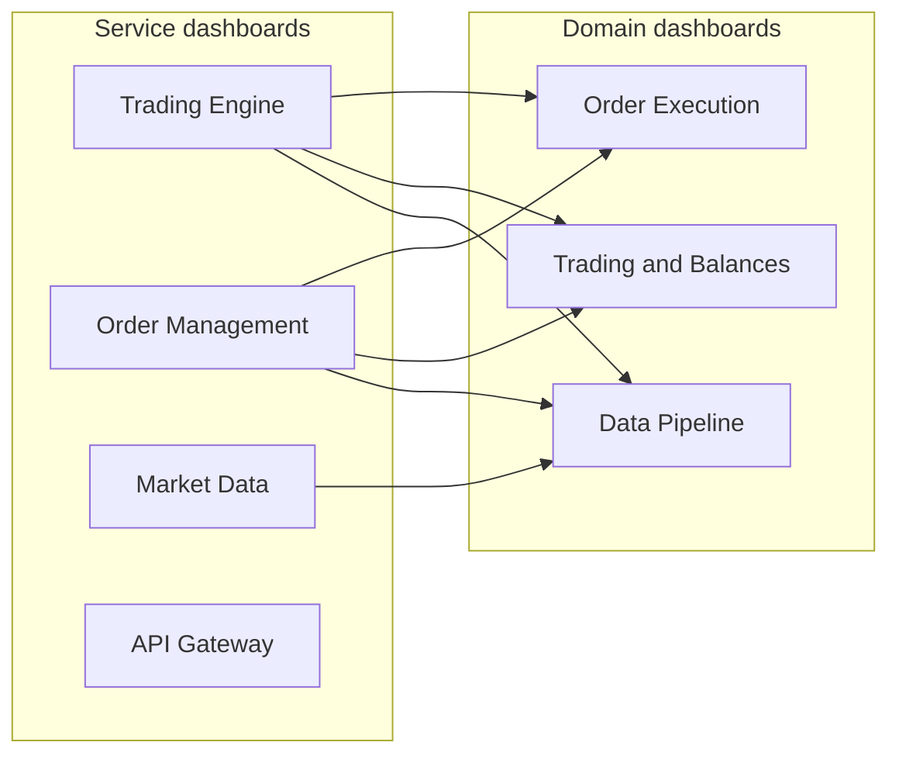

# Production-Ready Metrics Implementation Plan

This document outlines the recommended steps to implement production-ready Prometheus metrics and Grafana dashboards across the trading platform. It follows a two-layer approach: **service-centric** metrics (ownership and health per service) and **domain/flow** metrics (SLOs and cross-service flows).

**Principle:** The same metric can appear in both a service dashboard and a domain dashboard; differentiate by query scope (e.g. `job=~"trading-engine.*"` in the service dashboard, and `sum(...) by (job)` or multi-job filters in the domain dashboard). Do not duplicate metric definitions in Prometheus.

---

## Current State

### Trading Engine

- **Location:** `services/trading-engine/internal/metrics/metrics.go`
- **Exposed today:** `orders_executed_total` (counter, labels: `book`, `strategy`), `bitso_available_balance` (gauge, label: `currency`). The engine uses a `MetricsRecorder` interface in `services/trading-engine/internal/engine/engine.go` with `RecordOrderExecuted` and `RecordBalances`.
- **Tracked in-memory but not exported:** Signals processed/succeeded/failed, orders failed, last error, health check failures, Kafka consume/parse errors, order-placed publish success/failure, dry-run vs live. See `EngineStatistics` in `engine.go` and log paths in the consumer loop and signal processor.

### Order Management

- **Location:** `services/order-management/internal/metrics/prometheus.go`
- **Exposed today:** Orders (created, filled, cancelled, rejected, active), `order_processing_duration_seconds` by stage, validations, risk checks/violations, repo operations/duration, events published/failed, Kafka consumed/produced/lag, HTTP request total/duration/in-flight, service uptime/health, intraday (daily realized/unrealized P&L, drawdown, equity, trades/wins/losses today). Session snapshot is used for trading-engine session risk via `GET /api/v1/risk/session`.

### Market Data

- **Location:** `services/market-data/internal/metrics/prometheus.go`
- **Exposed today:** `market_data_trades_total`, `market_data_trade_latency_seconds`, trade volume/value, orderbook updates/depth, ticker updates/latency, cache hits/misses/operations, storage operations/latency/errors, WebSocket connections/messages/errors/reconnects, API requests/response time/errors, memory/CPU/goroutines.

### API Gateway

- **Location:** `services/api-gateway/internal/metrics/prometheus.go`, `internal/middleware/metrics.go`
- **Exposed today:** Namespace `api_gateway_`: `http_requests_total`, `http_request_duration_seconds`, `http_requests_in_flight`, `http_request_size_bytes`, `http_response_size_bytes`, `backend_calls_total`, `backend_call_duration_seconds`, `backend_errors_total`, circuit breaker state/ops, rate limit hits/allows, service uptime/health, goroutines, memory usage.

### Backtesting

- **Location:** `services/backtesting/internal/metrics/prometheus.go`
- **Exposed today:** Backtests created, backtests completed/failed (by status), backtest duration histogram, active backtests gauge, events processed (by type), data load duration, metrics calculation time, service uptime/health.

### Grafana Dashboards (current layout)

- **Location:** `monitoring/grafana/dashboards/` (flat): `trading-engine.json`, `trading-metrics.json`, `order-management.json`, `market-data.json`, `api-gateway.json`. The script `scripts/grafana-import-trading-dashboard.sh` imports `trading-metrics.json` (appears as "Trading Platform Metrics"). The script `scripts/grafana-import-dashboard.sh` maps names (e.g. `trading-metrics`, `trading-engine`) to these JSON files under a single `DASHBOARDS_DIR`.

---

## Implementation Phases (in order)

### Phase 1: Trading Engine Production-Ready Metrics

**Goal:** Add production-ready metrics so operators can monitor execution outcomes, signal throughput/drops, balance freshness, Bitso and Kafka health, and engine state (including dry-run).

**Metrics to add**

| Category | Metric | Type | Labels | Purpose |
|----------|--------|------|--------|---------|
| Execution | `orders_failed_total` | Counter | book, strategy, reason | Failure rate; reason: validation, bitso_api, session_risk, ticker_fetch |
| Execution | `order_execution_duration_seconds` | Histogram | book, strategy | PlaceOrder latency |
| Signals | `signals_received_total` | Counter | — | Kafka consume throughput |
| Signals | `signals_processed_total` | Counter | book, strategy, outcome | outcome: success, failed |
| Signals | `signals_dropped_total` | Counter | reason | reason: channel_full, timeout, context_cancelled |
| Signals | `signal_processing_duration_seconds` | Histogram | — | Receive to decision latency |
| Balance/Bitso | `bitso_balance_fetch_errors_total` | Counter | — | Balance API failures |
| Balance/Bitso | `bitso_balance_last_success_timestamp_seconds` | Gauge | — | Unix time of last successful fetch; alert if stale |
| Session risk | `session_risk_checks_total` | Counter | result | result: allowed, rejected |
| Session risk | `session_risk_rejections_total` | Counter | — | Orders blocked by daily loss/drawdown |
| Kafka | `kafka_messages_consumed_total` | Counter | topic | Consume throughput |
| Kafka | `kafka_consumer_errors_total` | Counter | — | Consume errors |
| Kafka | `order_placed_events_published_total` | Counter | — | Sync to order-management |
| Kafka | `order_placed_events_publish_errors_total` | Counter | — | Publish failures |
| Engine | `engine_state` | Gauge | — | 0=stopped, 1=initializing, 2=running |
| Engine | `trading_engine_dry_run` | Gauge | — | 1=dry-run, 0=live |
| Health | `health_check_failures_total` | Counter | — | Bitso/Redis health check failures |

**Tasks**

1. Extend `services/trading-engine/internal/metrics/metrics.go`: register the new counters, gauges, and histograms; add recorder methods (e.g. `RecordOrderFailed(book, strategy, reason)`, `RecordSignalReceived()`, `RecordSignalsProcessed(book, strategy, outcome)`, `RecordSignalsDropped(reason)`, `RecordSignalProcessingDuration(d)`, `RecordBalanceFetchError()`, `SetBalanceLastSuccessTimestamp(ts)`, `RecordSessionRiskCheck(result)`, `RecordSessionRiskRejection()`, `RecordKafkaMessageConsumed(topic)`, `RecordKafkaConsumerError()`, `RecordOrderPlacedPublished()`, `RecordOrderPlacedPublishError()`, `SetEngineState(state)`, `SetDryRun(bool)`, `RecordHealthCheckFailure()`). Optionally add `ObserveOrderExecutionDuration(book, strategy, d)` for the histogram.
2. Extend the `MetricsRecorder` interface in `services/trading-engine/internal/engine/engine.go` with the new methods (or pass a concrete metrics struct). Keep the interface optional so the engine still runs if recorder is nil.
3. Instrument the engine: in the Kafka consumer loop, record `signals_received_total` on consume and `kafka_consumer_errors_total` / `signals_dropped_total` on error or drop; in the signal processor, record `signal_processing_duration_seconds` and `signals_processed_total` (outcome success/failed); in `processTradeSignal`, record `orders_failed_total` with reason on each failure path, and `order_execution_duration_seconds` around execute; in `fetchAndCacheBalances`, record `bitso_balance_last_success_timestamp_seconds` on success and `bitso_balance_fetch_errors_total` on error; before execute, record `session_risk_checks_total` and `session_risk_rejections_total` when limits reject; in `publishOrderPlaced`, record publish success/error counters; in the health monitor, record `health_check_failures_total` on failure; at startup in `cmd/main.go`, set `trading_engine_dry_run` and `engine_state`, and update `engine_state` on start/stop.
4. Use bounded label values for `reason` (e.g. validation, bitso_api, session_risk, ticker_fetch) to keep cardinality low.

**Files touched:** `services/trading-engine/internal/metrics/metrics.go`, `services/trading-engine/internal/engine/engine.go` (MetricsRecorder and call sites), `services/trading-engine/cmd/main.go` (dry_run and state at startup).

---

### Phase 2: Other Services — Current vs Recommended

**Goal:** Document current metrics and list recommended additions per service for production-ready observability. Implement incrementally when prioritizing each service.

#### Order Management

- **Current:** See "Current State" above. Already strong: orders lifecycle, validations, risk, Kafka, HTTP, intraday P&L.
- **Recommended additions:** Bitso sync job: `bitso_sync_attempts_total`, `bitso_sync_errors_total`, `bitso_sync_last_success_timestamp_seconds`; session risk endpoint: `session_risk_requests_total`, `session_risk_request_errors_total` (or rely on HTTP metrics for `/api/v1/risk/session`). Optional: Kafka consumer lag by topic/partition if the client exposes it.

#### Market Data

- **Current:** Trades, ticker, orderbook, cache, storage, WebSocket, API, system.
- **Recommended additions:** `market_data_websocket_subscribe_errors_total`; historical range: `market_data_historical_requests_total`, `market_data_historical_request_duration_seconds`, `market_data_historical_errors_total` (for backtesting consumers). Optional: per-book or per-channel counters if cardinality is acceptable.

#### API Gateway

- **Current:** HTTP (requests, duration, in-flight, request/response size), backend (calls, duration, errors), circuit breaker, rate limiter, system.
- **Recommended additions:** None critical if backend metrics already cover trading-engine and order-management calls. Optional: labels for dependency (e.g. backend=order_management, backend=trading_engine) on backend metrics if not already present.

#### Backtesting

- **Current:** Backtests created/completed/failed, duration, active, events processed, data load duration, metrics calculation time, uptime/health.
- **Recommended additions:** `backtesting_data_fetch_errors_total` (by source: market_data, file); optional `backtests_completed_total` by book/strategy for domain dashboards.

---

### Phase 3: Domain/Flow Metrics and Dashboard Layout

**Goal:** Define domain dashboards (queries combining metrics from multiple services) and reorganize dashboard files into `services/` and `domain/` folders.

**Domain metrics (queries; no new Prometheus series)**

- **Order Execution:** Combine trading-engine `orders_executed_total`, `orders_failed_total`, `order_execution_duration_seconds` with order-management `orders_created_total`, `orders_filled_total`, `orders_rejected_total`, `order_processing_duration_seconds`. Example queries: `sum(rate(orders_executed_total[5m])) by (job)`, `sum(rate(orders_failed_total[5m])) by (job, reason)`, histograms for latency by job.
- **Trading / Balances & Risk:** Combine `bitso_available_balance` (trading-engine; use `max by (currency)(bitso_available_balance{job=~"trading-engine.*"})`), order-management intraday gauges (daily P&L, drawdown, equity, trades today). After Phase 1, add `session_risk_rejections_total`, `engine_state`, `trading_engine_dry_run`. See `monitoring/PROMETHEUS-TRADING-ENGINE-BALANCE.md` for balance query patterns.
- **Data Pipeline / Kafka:** Consumer lag, consume errors, publish errors from market-data, trading-engine, order-management; optional per-topic panels.
- **Platform Overview:** One row per service: `up{job=~"<service>.*"}`, error rate (e.g. 5xx or failure counters), key throughput (e.g. orders/s). Links to service and domain dashboards.

**Dashboard folder structure**

```
monitoring/grafana/dashboards/
├── services/
│   ├── api-gateway.json
│   ├── market-data.json
│   ├── order-management.json
│   └── trading-engine.json
└── domain/
    └── trading-metrics.json
```

- **services/:** One dashboard per service; panels scoped to that service (e.g. `job=~"trading-engine.*"`). Add Phase 1 trading-engine panels to `trading-engine.json`.
- **domain/:** `trading-metrics.json` is the main platform/trading dashboard (intraday P&L, scrape status, Available Balance, etc.). It is the dashboard imported by `scripts/grafana-import-trading-dashboard.sh`. Optionally add `order-execution.json`, `data-pipeline.json`, or a single `platform-overview.json`; or keep a single domain dashboard and add rows for Order Execution and Data Pipeline.

**Script updates**

1. **scripts/grafana-import-trading-dashboard.sh:** Set `DASHBOARD_JSON="$REPO_ROOT/monitoring/grafana/dashboards/domain/trading-metrics.json"` (after moving the file).
2. **scripts/grafana-import-dashboard.sh:** Use two base dirs: for `trading-metrics` use `.../dashboards/domain/trading-metrics.json`; for `trading-engine`, `order-management`, `api-gateway`, `market-data` use `.../dashboards/services/<name>.json`. Update the case statement or path construction accordingly.

**Tasks**

1. Create `monitoring/grafana/dashboards/services/` and `monitoring/grafana/dashboards/domain/`. Move `trading-engine.json`, `order-management.json`, `market-data.json`, `api-gateway.json` into `services/`. Move `trading-metrics.json` into `domain/`.
2. Update `scripts/grafana-import-trading-dashboard.sh` and `scripts/grafana-import-dashboard.sh` to the new paths.
3. After Phase 1, add or update panels in `services/trading-engine.json` for the new metrics; add or update panels in `domain/trading-metrics.json` (e.g. signals, orders failed, engine_state, dry_run, session_risk_rejections) using queries that span job where appropriate.
4. If Grafana provisioning (ConfigMaps or dashboard provider) is used, update config to point at both folders or at the parent directory that includes both subdirs.

**Files touched:** All JSON files under `monitoring/grafana/dashboards/` (moved), `scripts/grafana-import-trading-dashboard.sh`, `scripts/grafana-import-dashboard.sh`, optional provisioning YAML.

---

### Phase 4: Prometheus Alert Rules

**Goal:** Define and maintain Prometheus alert rules for critical metrics so operators are notified of balance staleness, high order failure rate, engine not running, and health check failures (as called out in Phase 1 and the plan’s Next Steps).

**Alerts to define**

| Alert name | Expression (concept) | For | Severity | Purpose |
|------------|----------------------|-----|----------|---------|
| BalanceLastSuccessTimestampStale | `(time() - bitso_balance_last_success_timestamp_seconds) > 300` | 2m | critical | No successful balance fetch in 5m |
| TradingEngineOrdersFailedRateHigh | `sum(rate(orders_failed_total[5m])) > 0.5` | 3m | critical | Order failure rate too high |
| TradingEngineNotRunning | `up == 1 and engine_state != 2` (job=~"trading-engine.*") | 5m | warning | Service up but engine not in running state |
| TradingEngineHealthCheckFailuresHigh | `increase(health_check_failures_total[15m]) > 5` | 2m | warning | Bitso/Redis health check failures increasing |
| ServiceDown | `up == 0` | 1m | critical | Target unreachable |
| HighOrderExecutionLatency | p95 of `order_execution_duration_seconds` > 5s | 3m | warning | Slow order execution |
| LowAvailableBalance | `bitso_available_balance < 1000` | 1m | critical | Low balance (adjust threshold per env) |

Existing alerts (TradingEngineHighErrorRate, APIRateLimitExceeded) remain; HighOrderExecutionLatency and LowAvailableBalance are scoped to `job=~"trading-engine.*"` where appropriate.

**Tasks**

1. Add or update rule file(s) under `monitoring/prometheus/rules/` (e.g. `trading-alerts.yml`) with the above alerts. Use `job=~"trading-engine.*"` for trading-engine metrics so they work with multiple replicas or job labels.
2. Ensure `prometheus.yml` has `rule_files: - "rules/*.yml"` and that the Prometheus deployment mounts the rules directory.
3. Configure Alertmanager (routing, severity, on-call) for the new alert labels (`service`, `severity`).
4. Document alerts in `monitoring/prometheus/rules/README.md` (name, condition, severity, runbook link if any).

**Files touched:** `monitoring/prometheus/rules/trading-alerts.yml`, `monitoring/prometheus/rules/README.md`, optionally `monitoring/prometheus/prometheus.yml` if rule_files were missing.

---

### Scrape configuration (prerequisite for metrics and alerts)

For metrics and alerts to work, Prometheus must scrape each service’s `/metrics` endpoint. The reference config is `monitoring/prometheus/prometheus.yml`.

**Required scrape jobs (per service):**

| Job name | Target (example) | Metrics path |
|----------|------------------|--------------|
| prometheus | localhost:9090 | default |
| trading-engine | trading-engine:8080 | /metrics |
| order-management | order-management:8084 | /metrics |
| market-data | market-data:8083 | /metrics |
| api-gateway | api-gateway:8085 | /metrics |
| backtesting | backtesting:8081 | /metrics |

When adding a new service that exposes Prometheus metrics, add a corresponding `scrape_configs` entry and ensure the service’s `job` label matches dashboard and alert queries (e.g. `job=~"trading-engine.*"`).

---

### Post-implementation validation (optional)

- **Metrics exposed:** After deploying a service, verify that its `/metrics` endpoint returns the expected series (e.g. `curl -s http://<service>:<port>/metrics | grep -E '^orders_failed_total|^engine_state'`).
- **Alerts load:** In Prometheus UI, check Status → Rules and confirm that rule groups load without errors and that alert names appear.
- **Dashboards:** After importing dashboards, confirm panels show data (or “No data” with a valid query); fix any broken or deprecated metric names.

---

## Dashboard and Metric Relationship



The same Prometheus series are queried in both service and domain dashboards; domain dashboards use broader filters or `by (job)` aggregations.

---

## Summary Table

| Phase | Description | Outcome | Status |
|-------|-------------|---------|--------|
| 1 | Trading Engine production metrics | Counters/gauges/histograms for execution, signals, balance, Bitso, Kafka, engine state, health | Done |
| 2 | Other services (OM, market-data, api-gateway, backtesting) | Document current + recommended additions; implement when prioritizing | Done |
| 3 | Domain/flow metrics and dashboard layout | services/ and domain/ folders; import script paths; domain query/panel spec | Done |
| 4 | Prometheus alert rules | Alerts for balance stale, orders failed rate, engine state, health check failures, service down, latency, low balance | Done |

---

## Next Steps

1. **Phase 1–3:** Already implemented; maintain dashboards and metrics as new features are added.
2. **Phase 4 (Alerts):** Implemented in `monitoring/prometheus/rules/trading-alerts.yml`. Tune thresholds (e.g. order failure rate, balance staleness window, low-balance threshold) per environment; configure Alertmanager routing and runbooks.
3. **Scrape config:** When adding services, add a matching `scrape_configs` entry in `monitoring/prometheus/prometheus.yml` so metrics and alerts have data.
4. **Validation:** Optionally run post-deploy checks (curl `/metrics`, Prometheus Rules UI, dashboard panels) to confirm metrics and alerts are active.

---

## References

- [Prometheus: Metric and label naming](https://prometheus.io/docs/practices/naming/)
- Project: `monitoring/PROMETHEUS-TRADING-ENGINE-BALANCE.md` (balance metric and deduplication)
- Project: `INTRADAY-STRATEGY-IMPLEMENTATION-PLAN.md` (intraday metrics and Grafana)
- Dashboards: `monitoring/grafana/dashboards/services/`, `monitoring/grafana/dashboards/domain/`
- Import scripts: `scripts/grafana-import-trading-dashboard.sh`, `scripts/grafana-import-dashboard.sh`
- Alert rules: `monitoring/prometheus/rules/trading-alerts.yml`; see `monitoring/prometheus/rules/README.md` for alert list.
- Scrape config: `monitoring/prometheus/prometheus.yml`

---

**Document version:** 1.1  
**Status:** Phases 1–4 implemented. Phase 4 adds Prometheus alert rules for balance staleness, order failure rate, engine state, health check failures, service down, latency, and low balance. Scrape configuration and optional post-implementation validation are documented.
